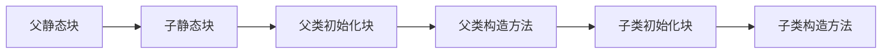
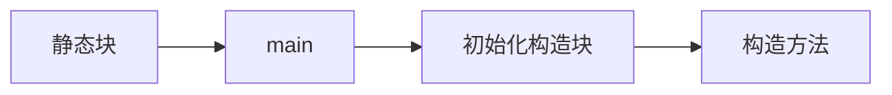
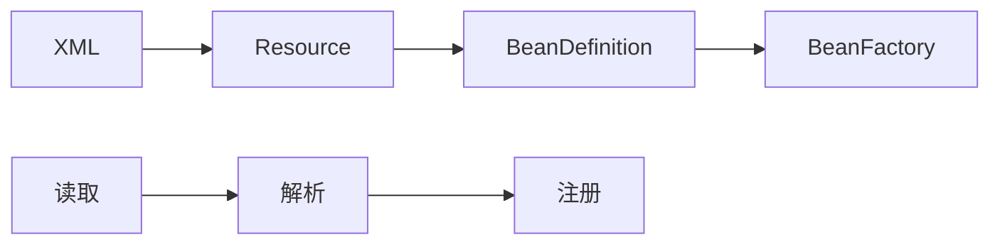

[TOC]

# Java基础

## Java语言基础

### 1、 Java语言有哪些特点？

1、简单易学，有丰富的类库

2、面向对象（Java最重要的特性，让程序耦合度更低，内聚性更高）

3、与平台无关（JVM是Java跨平台使用的根本）

4、可靠安全

5、支持多线程


### 2、面向对象和面向过程的区别

**面向过程**：是分析解决问题的步骤，然后用函数把这些步骤一步一步实现，然后在使用的时候一一调用，想能较高。单片机，嵌入式开发等一般采用面向过程开发

**面向对象**：是把构成问题的事务分解成各个对象，而建立对象的目的也不是为了完成一个个步骤，而是为了描述某个事物在解决整个问题的过程中所发生的行为，面向对象有**继承、封装、多台的特性**，所以已维护、易服用、易扩展。可以设计出低耦合的系统，但是性能上比面向过程要低


### 3、继承、封装、多态分别是什么？

#### 3.1、继承

继承是一种**类与类的**关系，子类拥有父类的所有属性和方法（除了private修饰的属性不能拥有），从而实现了代码的复用。

##### 3.1.1继承和实现的区别

###### 3.1.1.1、概念不同

继承：子类与父类的继承，如果多个类的某个部分的功能相同，那么可以抽象出一个类来，把他们相同部分都放到父类里，让他们都继承这个类

实现：接口的实现，如果多个类都有一个行为，但是处理的方法方式不同，那么久定义一个接口，就是一个标准，让各个类分别实现这个接口，各自实现自己具体的处理方法。

######  3.1.1.2、关键词不同

继承：extends

实现：implements

###### 3.1.1.3、数量不同

单继承、多实现

###### 3.1.1.4、属性不同

在接口中只能定义全局常量(static final)，和空的方法体，

继承中可以定义属性方法、变量、常亮等。

###### 3.1.1.5、限制不同

某个接口被类实现时，在类中一定要实现接口中的抽象方法，

继承不需要


#### 3.2、封装

  将类的某些信息隐藏在类内部，不允许外部程序直接访问。而是**通过该类提供的方法来实现对隐藏信息的操作和访问，常见的实现方式就是：getter,setter**

  封装遵循“开闭原则”，禁止外部直接访问和修改类的信息


##### 3.2.1 类变量、成员变量和局部变量

类变量（静态变量）：用static 修饰的变量称为静态变量，其内容被该类的所有对象共享，**所有对象的值都指向相同的一处内存**，随便一个对象修改了此处内存的值都将影响其他对象


成员变量：在类定义声明的变量，随着对象的建立而建立，随着对象的消失而消失，存在于对象的**堆内存**中


局部变量：在函数中声明的变量，只定义在局部范围内，只在所属的区域有效，存在于**栈内存**中，作用的范围结束，栈帧释放，变量就是消失。

*注意：内存的划分在JVM篇的内存划分部分*


##### 3.2.2 成员变量以及方法作用域（可见性）---default、private、protecte、public

我们在定义成员变量和方法时，前面都会加上作用域修饰符（如果不加、默认为default）

不同修饰符下，该成员变量或方法的作用域是不同的：

|           | 类内部 | 本包 | 子类 | 外部包 |
| --------- | ------ | ---- | ---- | ------ |
| public    | √      | √    | √    | √      |
| protected | √      | √    | √    | ×      |
| default   | √      | √    | ×    | ×      |
| private   | √      | ×    | ×    | ×      |


##### 3.2.3 构造函数与默认构造函数

构造函数是用来初始化对象的，一个类可以重载多个构造函数。

需要注意的是：默认情况下，一个类会有一个默认的构造函数，这个构造函数没有内容也没有返回值，一般都略去不写


但是，如果一个类定义了一个有参数有方法体的构造函数，这时编译器就不会再给它默认加上一个无参并且方法体为空的构造函数，可以理解为无参的构造函数被覆盖，此时需要手动定义一个无参构造函数。


在函数的继承里，子类必须使用super来实现对父类的非默认构造函数的调用，在创建对象时，先调动父类默认构造函数，然后调用子类自身定义的构造函数


#### 3.3、多态

  Java中的多态主要指**引用多态和方法多态**

  引用多态：父类引用可以指向本类对象，也可以指向子类对象。引用多态的强大主要体现在调用属性、方法时，可以根据引用具体指向的对象去调用，例如：子类中重写了父类方法

  方法多态：子类中可以重写父类的方法，在调用方法时根据引用指向的子类对象决定调用哪个具体的方法。方法多态的强大主要体现在可以根据调用时的参数不同，而自主匹配调用的方法，例如：重载。


### 4 、重载和重写的区别

  重载：发生在同一个类中，存在多个方法的**方法名相同，但是参数列表不同**。参数列表不同只的是**参数个数，参数类型，或者参数的顺序**不同， 但要注意子类函数的访问修饰权限不能少于父类的。 

  重写：一般发生在有几成关系的子类中，子类中定义了一个方法，其**方法名，返回值类型，参数列表**与父类中的某个方法一模一样，此时就是子类中重写了父类的同名方法。


### 5、基本数据类型，以及其封装类

| 基本类型            | 大小（字节） | 默认值       | 封装类    |
| ------------------- | ------------ | ------------ | --------- |
| byte（字符类型）    | 1            | (byte)0      | Byte      |
| short（基本整型）   | 2            | (short)0     | Short     |
| int（基本整型）     | 4            | 0            | Integer   |
| long（基本整型）    | 8            | 0L           | Long      |
| float（浮点型）     | 4            | 0.0f         | Float     |
| double（浮点型）    | 8            | 0.0d         | Double    |
| boolean（布尔类型） | -            | false        | Boolean   |
| char（字符类型）    | 2            | \u0000(null) | Character |

注意：

​		1、int是基本数据类型，Integer是int的封装类，是引用类型。int默认值是0，而Integer默认值是null，所以Integer可以区分0和null的情况，一旦Java看到null，就知道这个引用还没有指向某个对象，在使用任何引用前，必须为其指定一个对象，否则会报错。

​		2、基本数据类型在声明时系统会自动给它分配空间，而引用类型声明时只是分配了引用空间，必须通过实例化开辟数据空间之后才可以赋值，数组对象也是一个引用对象，将一个数组赋值给另一个数组时只是复制了一个引用，所以通过某一个数组所做的修改在另一个数组中也看得见。

​		虽然定义了boolean这种数据类型，但是只对它提供了非常有限的支持，在Java虚拟机中没有任何供boolean值专用的字节码指令，Java语言表达式所操作的booealn值，在编译之后都使用Java虚拟机中的int数据类型来替代，而boolean数据会被编码成Java虚拟机的byte数组，每个元素boolean元素占8位，这样我们可以得到boolean类型占了单独使用是4个字节，在数组中又是1个字节，使用int的原因是，对于当下32位的CPU来说，一次处理数据是32位，具有高效存取的特点。

### 6、String属于基础的数据类型吗？

​		String不是基本的数据类型，是final修饰的Java类，Java中的基本类型一共有8个。


### 7、instanceof关键字的作用

​		instanceof严格来说是Java中的一个双目运算符，用来测试一个对象是否是类的示例，用法：

```java
boolean result = obj instanceof Class
```

​		其中obj为一个对象，Class表示一个类或者一个接口，当obj为Class的对象，或者是其直接或间接的子类，或者是其接口的实现类，结果都返回true，否则返回false


### 8、Java自动装箱和拆箱

​		**装箱就是自动将基本数据类型转换为包装器类型（int-->Integer）：调用方法：Integer的valueOf(int)方法**

​		**拆箱就是自动将包装类类型转换为基本数据类型（Integer-->int）：调用方法：Integer的intValue方法**

​		在Java SE5之前，如果要生成一个数据为10的Integer对象，必须进行：

```java
Integer i = new Integer(10)
```

​		而在Java SE5之后，就提供了自动装箱的特效型，：

```java
Integer i = 10;
```

​		Integer的ValueOf方法的具体实现：

```java
public static Integer valueOf(int i){
    if(i >= -128 && i<=Integer.high){
        return IntegerCache.cache[i + 128];
    }else{
        retrun new Integer(i);
    }
    
}
```

​		在通过valueOf方法创建Integer对象的时候，如果属猪是在[-128,127]之间，便返回指向IntegerCache.cache中已经存在的对象的引用；否则创建一个新的Integer对象。

​		

### 9、equals与==的区别

==：

​		==比较的是变量（栈）内存中存方法的对象的（堆）内存地址，用来判断两个对象的地址是否相同，即是否是指向同一个对象，比较的是真正意义上的指针操作。

equasl：

​		equals用来比较的是两个对象的内容是否相等，由于所有的类都是集成自Java.lang.Object类的，所以适用于所有对象，如果没有对该方法进行覆盖的话，调用的仍然是Object类中的方法，而Objec中的equasl方法返回的确实==的判断

总结：

​		==是一个比较运算符，基本数据类型比较的是值，引用数据类型比较的是地址值。（地址值即是值是否为同一个对象的引用）

​	equasl()是一个方法，只能比较引用数据类型，重写前比较的是地址值，重写后比一般是比较对象的属性。


### 10、两个对象的HashCode()相同，则equals()也一定为true，对吗？

​		如果是同一个类的不同对象，当两者拥有相同hashcode的时候，则一定相等，或者equals成立的时候则hashcode一定为真，这也就是所谓的相等的对象具有行为一致性。


### 11、Java的四种引用，强弱软虚

* 强引用

  强引用是平时使用最多的引用，强引用在程序内存不足（OOM）的时候也不会被回收，使用方式：

  ```java
  String str = new String("str")
  ```

* 软引用

  软引用在程序内存不足时，会被回收

  ```java
  // 注意：wrf这个引用也是强引用，它是指向SoftReference这个对象的，
  // 这里的软引用指的是指向new String("str")的引用，也就是SoftReference类中T
  
  SoftReference<String> wrf = new SoftReference<String>(new String("str"));
  ```

  可用场景：创建缓存的时候，创建的对象放进缓存中，当内存不足时，JVM会回收早先创建的对象

* 弱引用：

  弱引用就是只要JVM垃圾回收期发现了它，就会将之回收：

  ```java
  WeakReference<String> wrf = new WeakReference<String>(str);
  ```

  **使用场景：**Java源码中的`java.util.WeakHashMap`中的`key`就是使用弱引用，一旦我不需要某个引用，JVM会自动帮我处理它，我不需要做其他擦操作

* 虚引用

  虚引用回收机制和弱引用差不多，但是它被回收之前，会被放到`ReferenceQueue`中，其他引用时在被回收之后才放入`ReferenceQueue`中的，由于这个机制，所以虚引用大多被用于引用销毁前的处理工作。

  ```java
  PhantomReference<String> prf = new PhantomReference<String>(new
  String("str"), new ReferenceQueue<>());
  
  ```

  可用场景：对象销毁前的一些操作，比如说释放资源等，`Objece.finalize()`虽然也可以做这类动作，但是这个方式不安全且抵消


### 12、泛型

泛型是Java 1.5之后的特性


 使用泛型的好处是我们不必因为添加元素类型的不同而定义不同类型的集合，如整型集 合类，浮点型集合类，字符串集合类，我们可以定义一个集合来存放整型、浮点型，字符串型数据，而 这并不是最重要的，因为我们只要把底层存储设置了Object即可，添加的数据全部都可向上转型为 Object。 更重要的是我们可以通过规则按照自己的想法控制存储的数据类型。  


### 13、Java创建对象有几种方式？

Java中提供了四种方式：

* new创建对象
* 通过反射机制
* 采用clone机制
* 通过序列化机制


### 14、final有哪些用法

* final修饰的类不可以被继承
* final修饰的方法不可以被重写
* final修饰的变量不可以被改变，如果修饰引用，那么引用不可变，引用指向的内容看一遍
* final修饰的方法，JVM会尝试将其内联，以提高运行效率
* final修饰的常亮，在编译阶段会存入 常量池中

### 15、static有哪些用法

static基本用法，静态变量和静态方法，就是被static所修饰的变量、方法都属于类的静态资源，类实例所共享。

除了这两个方法以外，static也用于静态代码块，用于初始化操作：

```java
public Class PreCache{
    static{
        //执行相关操作
    }
}
```

除此之外static也多用于修饰内部类，诚挚为静态内部类

最后一种就是静态导包,即`import static`，这是JDK1.5只有引入的新特性，可以用来指定某个类中的静态资源，并且不需要使用类型，可以直接使用资源名

```java
import static java.lang.Math.
*;
public class Test{
	public static void main(String[] args){
		//System.out.println(Math.sin(20));传统做法
		System.out.println(sin(20));
	}
}
```


### 16、a=a+b与a+=b有什么区别？

`+=`操作符会进行隐式自动类型转换，此处a+=b隐式的将加操作的结果类型强制转换为持有结果的类型，而a=a+b则不会自动进行类型转换

```java
byte a = 127;
byte b = 127;
b = a + b;; // 报编译错误:cannot convert from int to byte
b += a;

```


### 17、Java中操作字符串都有哪些类？它们之间有什么区别？

* char charAt(int indexx)返回指定索引出的char值
* int  codePonintAt(int index)返回指定索引处的字符串
* int codePointBefore(int index) 返回指定索引之前的字符串

....


###  18、String str = "aaa" 与 String str = new String("aaa")一样吗？

​		不一样，"aaa"是一个字符串常量，它应该被放在静态存储区中，和static,final变量放在一块，而new String("aaa")创建了一个和字符串"aaa"内容相同的字符串，不过这个字符串放在堆上，String str = new String("aaa")，在这条语句中产生了两个字符串，第一个字符串是字符串常量"aaa"，第二个字符串是new String 语句产生的字符串，它的内容和"aaa"一样


### 19、如何将字符串翻转？

​		通过StringBuilder的reverse()方法


### 20、String类的常用方法有哪些

1、求字符串长度length()

2、求字符串某一位置字符 charAt(int index)

3、提取子串 upstring(int begin,int index)

4、字符串比较compareTo

5、字符串连接concat(String str) 


### 21、抽象类必须要有抽象方法吗？(abstract)

​		抽象类中可以没有抽象方法，但是抽象方法一定在抽象类中因为抽象方法和抽象类一样不能被实例化。


### 22、普通类和抽象类有哪些区别？

抽象类：

1. 抽象类中可以有普通方法，如果想让方法子类必须实现，就弄成抽象方法。
2. 如果抽象类中有抽象方法，那么这个类必须定义为抽象类
3. 抽象类不能被new

普通类：

1. 抽象类中不能有抽象方法
2. 如果一个普通类实现了一个抽象接口或者抽象类，那么意味着必须重写抽象方法


### 23、抽象类能用final修饰吗

​		不能


### 24、接口和抽象类有什么区别？

1、抽象类和接口都不能直接实例化，如果要实例化，抽象变量必须指向实现所有抽象方法的子类对象，接口变量必须指向实现所有接口方法的类对象。

2、抽象类必须要被子类继承，接口要被类实现

3、接口只能做方法申明，抽象类中可以做方法声明，也可以做方法实现

4、接口里定义的变量只能是公共的静态的常亮，抽象类中的变量是普通变量

5、抽象类里的抽象方法必须全部被子类所实现，如果子类不能全部实现，那么该子类只能是抽象类，同样，一个实现接口的时候，如果不能全部实现接口方法，那么该类也只能为抽象类

6、抽象方法只能申明，不能实现，接口时设计的结果，抽象类是重构的结果

7、抽象类里可以没有抽象方法

8、如果一个类里有抽象方法，那么这个类只能是抽象类

9、抽象方法要被实现，所以不能是静态的，也不能是私有的

10、接口可以继承接口，并多继承接口，但类只能单根继承


### 25 String,StringBuffer和StringBuilder的区别是什么？

​		String是只读字符串，它并不是基本数据结构，而是一个对象。从底层源码来看是一个final类型的字符数组，所引用的字符串不能被改变。一旦被定义就无法在增删改，每次对String的操作都会生成一个新的String对象

```java
private final char value[]
```

​		每次+操作：隐式在堆上new了一个跟原字符串相同的StringBuilder对象，再调用append方法拼接+后面的字符

​		StringBuffer和StringBuilder它们都继承了AbstarctStringBuilder抽象类，它们的底层都是可以改变的字符数组，所以在进行频繁的字符串操作的时候，建议使用此两种来进行操作，另外StringBuffer加了同步锁或者对调用的方法加了同步锁，所以是线程安全的，StringBuilder并没有加同步锁，所以是非线程安全的。


## Java容器

### 1、Java容器都有哪些？

​		数组String.java.util下的集合容器

​		数据长度限制为Integer.Integer.MAX_VALUE

​		String的长度限制，底层是char数组，长度Integer.MAX_VALUE,线程安全的。

​		

List：存放有序，列表存储，元素可以重复

Set：无序，元素不可以重复

Map：无序，元素可以重复


### 2、Collecion和Collections有什么区别？

​		1、Collection是一个**集合接口（集合类的一个顶级接口）**。它提供了对集合对象进行基本操作的通用接口方法，Collection接口在Java类库中有很多具体的实现，Collection接口的意义是为各种具体的集合提供了最大化的统一操作方式，其直接继承List与Set

> Collection
>
> > List
> >
> > > LinkedList
> > >
> > > ArrayList
> > >
> > > Vector
> > >
> > > > Stack
>
> ===
>
> > Set

​		2、Collections则是集合类的一个工具/帮助类，其中提供了一系列静态方法，用于对集合中元素进行排序，搜索以及线程安全等各种操作。


###  3、List、Set、Map之间的区别是什么？

​		Java中的集合包括三大类，即List、Set、Map，他们都出于java.util保重，Set、List和Map都是就扣，他们都有自己的实现类，set的实现类有HashSet和TreeSet、List的实现类有ArrayList、LinkedLisk

、Vector、Map的实现类主要有HshMap和TreeMap

​		Set中的对象不按特定方式排序，并且没有重复对象。但它的有些实现类能对集合中的对象按特定方式排序，例如TreeSet，它可以按照默认排序，也可以通过实践java.util.Comparator<Type>接口来自定义排序方式

​		List的对象按照索引位置排序，可以有重复对象，允许按照对象在集合中的索引位置检索对象，如通过list.get(i)方式来获得List集合中的元素

​		Map的每一个元素包含键值对，键对象不能重复，值对象可以重复


### 4、HashMap和Hashtable有什么区别

​		1、HashMap可以等价于HashTable，除了HashMap是非synchronize（线程安全的），并且可以使用null为key-value值，而HashTable不可以

​		2、HashMap是非线程安全的，而HashTable是线程安全的，多个线程可以共享一个HashTable；如果没有正确的同步的话，HashMap是不能多个线程共享的，Java5提供了ConcurrentHashMap,它是HashTable的替代，比HashTable扩展性更好

​		3、HashMap的迭代器是fail-fast迭代器，而HashTable的enumerator迭代器不是fail-fast的，所以当有其他线程改变了HashMap的结果（增加或者移出元素），就会抛出ConcurrentModifycationException，但迭代器本身的remove()方法移除元素则不会抛出ConcurrentMOdificationException，但这并不是一个一定发生的行为，要看JVM。这同样是Enumerator和Iterator的区别

​		4、由于HashTable是线程安全的，所以在单线程环境下它比HashMap要慢，

​		5、HashMap不能保证随着时间的推移Map中的元素次序是不变的


### 5、如何决定使用HashMap还是TreeMap？

​		TreeMap的key按照自然增加顺序排序，HashMap没有顺序，HashMap速度快


### 6、说一下HashMap的实现原理？

​		HashMap的主干是一个Entry数组，Entry是HashMap的基本组成单位，每个Entry包含一个key-value键值对。

​		HashMap是由数组+链表组成的，我们通过put()和get()方法存储和获取对象，当我们将键值对传递给put（）方法的时候，它调用键对象的hashCode()方法来计算hashcode，让后找到bucket位置来储存值对象。当获取对象时，通过键对象的equals()方法找到正确的键值对，然后返回值对象。HashMap使用链表来解决碰撞问题，当发生碰撞了，对象将会储存在链表的下一个节点中。 HashMap在每个链表节点中储存键值对对象。

当两个不同的键对象的hashcode相同时会发生什么？ 它们会储存在同一个bucket位置的链表中。键对象的equals()方法用来找到键值对。


### 7、Hashmap的结构，1.7和1.8有哪些区别

不同点：

​		1、JDK1.7采用的是头插法， 而1.8之后是尾插法。之所以会这样做，是因为1.7是用单链表进行的纵向眼神，当采用头插法时容易出现逆序并且环形链表形成死循环，但是在1.8之后因为加入了红黑树使用尾插法，能够避免出现逆序并且链表死循环的问题。

​		2、扩容后数据存储位置的计算方式也不一样：

​			1、在1.7的时候只用接hash值和需要扩容的二进制进行&（这里就是为什么扩容的时候为什么一定必须是2的多少次幂的原因所在，因为如果只有2的n次幂的情况时最后一位二进制数才一定是1，这样才嫩恶搞最大程度减少hash碰撞）**（hash值 & length-1）**

​			2、在1.8的时候直接用了1.7的时候计算的规律，也就是扩容前的原始位置+扩容的大小事=JDK1.8的计算方式，而不再1.7的那种异或的方法，但是这种方式就相当于只需要判断Hash值的新增参与运算的位是0还是1就直接迅速计算出扩容后的存储方式

​		3、1.8的时候是数组+单链表的数据接口，1.8是数组+链表+红黑树的数组结构（当链表的深度达到8的时候，也就是默认阈值，就会自动扩容把链表转成红黑树的数据结构来吧时间复杂度从O(n)编程O(logN)提高效率）


### 8、说一下HashSet的实现原理

​		 ①是基于HashMap实现的，默认构造函数是构建一个初始容量为16，负载因子为0.75 的HashMap。封装了一个 HashMap 对象来存储所有的集合元素，所有放入 HashSet 中的集合元素实际上由 HashMap 的 key 来保存，而 HashMap 的 value 则存储了一个 PRESENT，它是一个静态的 Object 对象。

​		②当我们试图把某个类的对象当成 HashMap的 key，或试图将这个类的对象放入 HashSet 中保存时，重写该类的equals(Object obj)方法和 hashCode() 方法很重要，而且这两个方法的返回值必须保持一致：当该类的两个的 hashCode() 返回值相同时，它们通过 equals() 方法比较也应该返回 true。通常来说，所有参与计算 hashCode() 返回值的关键属性，都应该用于作为 equals() 比较的标准。

​		③HashSet的其他操作都是基于HashMap的。


### 9、ArrayList的基本实现原理？


### 10、ArrayList和LinkedList的区别是什么？

​		1、ArrayList的实现是基于数组的，LinkedList的实现是基于双线链表

​		2、对于随机访问，ArrayList是优于LinkedList

​		3、对于插入和删除操作，LinkedList是优于ArrayList

​		4、LinkedList比ArrayList更占内存，因为LinkedList的结点除了存储数据，还存储了两个引用，一个指向前一个元素，一个指向后一个元素。

### 11、如何实现数组和List之间的转换？

​		数组转List：Arrays.asList(array)；list转数组list.Array()


### 12、ArrayList和Vector的区别是什么？

​		1、Vector的方法都是同步的（Synchronized），是线程安全的，而ArrayList的方法不是的。因此ArrayList的性能比Vector好

​		2、当Vector或者ArrayList中的元素超过它的原始大小时，Vector会将它的容量翻倍，而ArrayList值只增加50%的大小，Arraylist有利于节约空间。

### 13、在Queue中Poll()和remove()有什么区别？

​		remove()方法和poll方法都是删除队列的头元素，remove方法在队列为空的情况下降抛异常，而poll方法将返回null。


### 14、哪些集合类是线程安全？

​		1、Vector：就比arrayList多了一个同步化机制（线程安全），因为效率较低，现在已经不太建议使用。在web应用中，特别是前台页面，往往效率是优先考虑的

​		2、stack：堆栈类，先进先出

​		3、HashTable：就比hashMap多了个线程安全。

​		4、enumeration：枚举，相当于迭代器。


### 15、迭代器Iterator是什么？

​		为了方便的处理集合中的元素，Java中出现了一个对象，该对象提供了一些方法专门处理集合中的元素，例如删除和获取集合中的元素，该对象就叫做迭代器。

​		

### 16、Iterator怎么使用？有什么特点？

​		Iterator遍历集合元素的过程中不允许线程对集合元素进行修改，否则会抛出ConcurrentModificationException异常。

​		Iterator遍历元素的过程中可以通过remove方法移除集合中的元素。

​		Iterator必须依附某个Collection对象而存在，Iterator本身不具有装在数据对象的功能。

​		Iterator.remove方法删除的是上一次Iterator.next()方法返回的对象。

​		next()方法，该方法通过游标指向的形式返回Iterator下一个元素


### 17、Iterator和Listlterator有什么区别？

1、ListIterator有add()方法，可以向List中添加对象，而Iterator不能

2、ListIterator和Iterator都有hasNext()和next()方法，可以实现顺序向后遍历，但是ListIterator有hasPrevious()和previous()，可以实现你想（顺序向前）遍历，Iterator就不可以。

3、ListIterator可以定位当前索引的位置，netIndext()和PreviousIndex（）可以实现，Iterator没有此功能

4、都可以实现删除对象，但是ListIterator可以实现对象的修改，set()方法可以实现，Iterattor仅能遍历，不能删除


### 18、怎么确保一个集合不能被修改?

```java
static{
    map.put(1,"one");
    map.put(2,"two");
    map = Collections.unmodifiableMap(map);
}
```


## JavaIO流

### 1、序列化的含义、意义以及使用场景?

​		序列化：将对象写入IO流中

​		反序列化：从IO流中恢复线程

​		意义：序列化机制允许将实现序列化的Java对象转换为字节序列，这些字节序列可以保存在磁盘上，或者通过网络传输，到达以后恢复成原来的对象，序列化机制可以使对象可以独立程序的运行而独立存在。

​		使用场景：所有可以在网络上的传输的对象都是必须可序列化的，比如RMI（远程方法调用），传入的参数或者返回的对象都是可以序列化的，否则会出错。**所有保存到磁盘的Java对象都必须是可以序列化的，程序创建的JavaBean类都实现serializeable接口**


### 2、序列化实现的方式。

​		实现序列化要实现`Serializable`接口或者`Externalizabale`接口之一，Serializable接口是一个标记接口，不用实现任何方法，一旦实现了此接口，该类的对象就是可以序列化的。


###  3、Serializable接口和Externalizable接口的差异


| **实现Serializable接口**                                     | **实现Externalizable接口** |
| ------------------------------------------------------------ | -------------------------- |
| 系统自动存储必要的信息                                       | 程序员决定存储哪些信息     |
| Java内建支持，易于实现，只需要实现该接口即可，无需任何代码支持 | 必须实现接口的两个方法     |
| 性能略差                                                     | 性能略好                   |


### 4、统一对象可以重复序列化吗？		

​		同一个对象序列化多次，只有一次序列化为二进制流，以后都只是保存序列化编号，不会重复序列化


### 5、Java序列化中如果有些字段不想进行序列化怎么办？

对于不想进行序列化，使用trasient关键字修饰。

transient关键字的作用是：阻止实例中那些用此关键字修饰的变量序列化；当对象呗反序列时，呗transient修饰的变量值不会被持久化和恢复。transient只能修饰变量，不能修饰类和方法。


### 6、Java的IO模型

1. 阻塞IO（BIO）
2. 非阻塞IO
3. IO多路复用（NIO）
4. 信号驱动IO
5. 异步IO（AIO）


### 7、IO和NIO有什么区别？

1. NIO是以块的方式处理数据，但是IO是以最基础的字节流的形式去写入和读出。所以在效率上NIO比IO效率高很多

2. NIO不在是和IO一样用OutputStream和InputStream输入流的形式来进行处理数据的。到那时于是基于这种流的形式，而是采用了通道和缓冲区的形式来进行处理数据。

3. NIO的通道是可以双向的，但是IO中的只能单向

4. NIO的缓冲区（就是一个字节数组）还可以进行分片，可以建立只读缓冲区、直接缓冲区和间接缓冲区，只读缓冲区就是字面意思，直接缓冲区是为了加快IO速度，而已一个特殊的方式分配其内存的缓冲区

5. NIO比传统BIO核心区别就是，NIO采用的多路复用的IO模型，普通的IO用的是阻塞的IO模型，两个之间的效率肯定是多路复用效率更高

6. 其他：

   [ https://mp.weixin.qq.com/s/N1ojvByYmary65B6JM1ZWA ]:


### 8、Java中的IO流

Java中IO流分为几种？

* 按流的流向分：可以分为输入流和输出流
* 按照操作单元划分，可以划分为字节流和字符流
* 按照流的角色划分为节点流和处理流

JavaIO流中的类大多都是从4个抽象类积累中派生出来的。

* InputStream/Reader：所有的流入类的基类，前者是字节输入流，后者是字符输入流
* OutputSteam/Write：所有输出流的基类，前者是字节输出流，后者是字符输出流

按操作方式分类结构图：


### 9、 File的常用方法都有哪些？

1. createNewFile()在指定位置创建一个空文件，成功就返回true，如存在就不创建，然后返回false
2. mkdir()在指定为创建一个单级文件夹
3. mkdirs()在指定位置创建一个多级文件夹


# Java进阶

## 多线程&并发

### 1、并行和并发有什么区别

1. 并行是在同一时刻执行多个事件，并发是在同一时间段内执行多个时间
2. 并行发生在不同的实体上，并发发生在同一个实体上，并发编程可以充分利用cpu的性能


### 2、线程和进程的区别？

进程：

​		是**并发执行的程序**在**执行过程中分配和管理资源**的基本单位，是一个动态概念，竞争计算机系统资源的基本单位。

线程：

​		是**进程的一个执行单元**，是进程内部调度实体，**比进程更小的独立运行的基本单位。线程也被称为轻量级进程**。一个程序至少一个进程。一个进程至少一个线程。

地址空间：

​		同一进程的线程共享进本进程的地址空间，而进程之间是独立的地址空间。

资源拥有：

​		同一进程内的线程共享本进程的资源如内存，IO，CPU，但是进程之间的资源是独立的。


### 3、守护线程是什么？

​		守护线程，专门用于服务其他的线程，如果其他的线程（即用户自定义线程）都执行完毕，连main线程而已执行完毕，那么jvm就会推出（即停止运行）-


### 4、Java中实现多线程有几种方式

1. 继承Thread类
2. 实现Runnable接口
3. 实现Callable接口通过FutureTask包装器来创建Thread线程
4. 使用ExcutorService,Callable,Future实现由返回结果的多线程。


### 5、如何停止一个正在运行的线程

​			1、使用退出标志，使线程正常退出，也就是当run方法完成之后线程终止

​			2、使用stop方法强行终止，但是不推荐这个方法，因为stop和suspend以及resume一样都过期作废的方法

​			3、使用interrupt方法中断线程

### 6、线程有哪些状态

五种

​		1、新建

​		2、就绪

​		3、运行

​		4、阻塞

​		5、死亡


### 7、说一下runnable和callable有什么区别？

​		1、Callable规定的方法时call()，Runnable规定的方法时run()，其中Runnable可以提交给Thread来包装下，直接启动一个线程来执行，而Callable则一般都是提交给ExecuteSerivce来执行

​		2、Callable的任务执行后可以返回值，而Runnable的任务不能得到返回值

​		3、call方法可以跑出异常，run方法不可以

​		4、运行Callabl任务可以拿到一个Future对象，c表示异步计算的结果


### 8、sleep()和wait()有什么区别？

​		sleep()方法正在执行的线程主动让出CPU（然后CPU就可以去执行其他任务），在sleep指定时间后CPU再回到该线程继续往下执行（**注意：sleep方法只让出了cpu，而不会释放同步资源锁）**

​		wait()方法则是指当前线程让自己暂时退让出同步资源锁，以便其他正在等待该资源的线程得到该资源进而运行，只有调用了notify（）方法，之前调用wait（）的线程才会解除wait状态，可以去参与竞争同步资源锁，进而得到执行。

​		sleep()方法可以在任何地方使用，wait()方法则只能在同步方法或同步代码块中使用

​		sleep()是线程类(Thread)的方法，调用会暂停此线程，指定的时间，但监控依然保持，不会释放对象锁，到时间自动恢复；wait()是Object的方法，调用会放弃对象锁，进入等待队列，待调用notify()/notifyAll()唤醒指定的线程或者所有线程，才会进入锁池，再次获得对象锁之后进入运行状态。


### 9、notify()和notifyAll()有什么区别？

notify可能会导致死锁，而notifyAll()不会

任何时候只有一个线程可以获得锁，也就是说只有一个线程可以运行synchronized中的代码

使用notifyAll,可以唤醒所有出于wait状态的线程，由等待池进入锁池，使其重新进入锁的争夺队列中，而notify只能唤醒一个

notify() 是对notifyAll()的一个优化，但它有很精确的应用场景，并且要求正确使用。不然可能导致死
锁。正确的场景应该是 WaitSet中等待的是相同的条件，唤醒任一个都能正确处理接下来的事项，如果
唤醒的线程无法正确处理，务必确保继续notify()下一个线程，并且自身需要重新回到WaitSet中.

### 10、线程的run()和start()有什么区别？

​		start()方法被用来启动新创建的线程，而且start()内部调用了run方法，这和直接调用run()方法的效果不一样，当你调用run()方法的时候，只会是在原来的线程中调用，没有新的线程启动，start()方法才会启动新线程。


### 11、为什么wait，notify和notifyAll这些方法不再Thread类里面

​		因为Java提供的锁是对象级而不是线程级的，每个对象都有锁，通过线程获得。如果线程需要等待某些锁，那么调用对象中的wait（）方法就有意义了，如果wait（）方法定义在Thread类中，线程正在等待的是哪个锁就不明显。简单来说，由于wait，notify和notifyAll都是锁级别的操作，所以把他们定义在Object类中因为锁属于对象。


### 12、为什么wait和notify方法要在同步代码块中调用

​		1、只有在调用线程拥有某个对象的独占锁时，才讷讷够调用该对象的wait(),notify()和notifyall()方法

​		2、如果不这么做，代码会抛出illegalMonitorStateException异常。

​		3、还有一个原因是为了避免wait和notify之间产生竟态条件。


### 13、创建线程池有哪几种方式？

​		1、newSingleThreadExcutor：单线程的线程池

​		2、newFixedThreadPool：固定大小的线程池

​		3、newCacheThreadPool：可缓存的线程池

​		4、newScheduledThreadPool：大小无限的线程池


### 14、线程池都有哪些状态？	

五种：

​		Running,ShutDown，Stop，Tidying，Terminated


### 15、线程池中submit（）和execute（）方法有什么区别

​		1、接受的参数不一样

​		2、submit有返回值，而execute没有，submit方法用于提交需要返回值的任务，线程池会返回一个future类型的对象，通过future对象可以判断任务是否执行成功。

​		3、submit方便Exception处理


### 16、在Java程序中怎么保证多线程运行的安全？

​		1、原子性：提供互斥访问，同一时刻只有一个线程对数据进行操作

​		2、可见性：一个线程对主内存的修改可以及时的被其他线程看到

​		3、有序性：一个线程观察汽提塔线程中的指令执行顺序，由于指令重排序，该观察结果一般杂乱无序。

### 17、多线程锁的升级原理是什么？

​		当对象获取所的时候，它首先使自己的高速缓存无效，这样就可以保证从主内存中装入变量。


### 18、什么是死锁？

​		死锁是指两个或两个以上的进程互相竞争资源或由于彼此通信而造成的一种阻塞线程，一方由于无法获取另一方的资源，导致自身线程无法继续运行下去。


### 19、怎么防止死锁？

​		设置枷锁顺苏，设置加锁时限；死锁检测。


### 20、ThreadLocal是什么？有哪些使用场景？

​		原来我们常用的局部变量和静态变量，在某种情况下无法满足要求，比如，我要求缓存一个变量，这个时候一般弄一个静态map存一下就解决了，但是有几个问题:

​	1、其他线程擅自修改我这个静态map怎么办？

​	2、静态map之间并发访问怎么办？

这个情况下，ThreadLocal就可以解决了，它的本质是一个内部的静态map，key是当前线程的一个句柄，value就是需要保存的值，value可以是任何值，value是一个map或者是其他的一个容器。

​		基于以上设计，每个线程无法获取到其他线程的key，由于是静态map，不提供遍历和查询的接口，也确保了其他线程只能根据key获取，所以每个线程只能取到自己线程的value。

​		这样既做到了线程安全，又在线程范围内提供了数据共享的能力


### 21、说一下自己对synchronized 关键字的了解

​		synchronized关键字解决的是多个线程之间资源访问的同步性，synchronized关键字可以保证被它修饰的方法或者代码块在任意时刻都只能有一个线程执行。

​		另外，在早期Java版本中，synchronized属于重量级锁，效率低下，因为监视器锁(monitor)是依赖于底层的操作系统的Mutex Lock来实现的，Java的线程是映射到操作系统的原生线程之上的，如果要挂起或者都需要操作系统帮忙完成，而操作系统实现线程之间的切换时需要从用户态转换到内核态。这个就是早期synchronized效率低的原因，在Java 6之后，对其进行了优化，如自旋锁，锁消除，轻量锁等。


### 22、说说自己怎么使用synchronized关键字的，以及synchronized三种主要的使用方式

1. **修饰实例方法**：作用于当前对象实例加锁，进入同步代码前要获得当前对象实例的锁
2. **修饰静态方法**：就是给当前类加锁，会作用于类的所有对象实例，因为静态成员不属于任何一个实例对象，是类成员(static表明这是该类的一个静态资源，不管new了多少个对象，只有一份)，所以如果一个线程A调用一个实例对象的非静态资源synchronized方法，而线程B需要调用这个实例对象所属类的synchronized方法时允许的，不会发生互斥现象，**因为访问静态爱子园synchronized方法占用的锁是当前类的锁，而访问非静态资源synchronized方法占用的锁是当前实例对象的锁**
3. **修饰代码块**：指定加锁对象，对给定对象加锁，进入同步代码库前要获得给定对象的锁
4. 总结：synchronized关键字加到static静态方法和synchronized（class）代码块上都是给Class类上锁。synchronized关键字加到实例方法上是给对象实例上锁，尽量不要使用synchronized（String a）因为JVM中，字符串常量池具有缓存功能

### 23、volatile关键字的作用?

​		一旦一个共享变量（类的成员变量，类的静态成员变量）被volatile修饰之后，那么就具备了两层语义：

* 保证了不同线程对这个变量进行操作时的可见性，即一个线程修改了某个变量的值，这新值对其他线程来说是立即可见的。
* 禁止进行指令重排序

### 24、讲一下Synchronized关键字的底层原理（****）


### 24、Synchronized和volatile的区别是什么？

* volatile本质是在告诉JVM当前变量在寄存器（工作内存）中的值是不确定的，需要从主存中读取；synchronized则是锁定当前变量，只有在当前线程可以访问该变量，其他线程被阻塞住
* volatile仅能使用在变量级别；synchronize则可以使用在变量、方法和 类级别的
* volatile仅能实现变量的修改可见性，并不能保证原子性；synchronized则可以保证变量的修改可见性和原子性。
* volatile不会造成线程的阻塞；synchronized可能会造成线程的阻塞
* volatile标记的变量就不会被编译器优化；synchronized标记的变量可以被编译器优化。


#### 25、synchronized和Lock有什么区别？

​		1、Lock不是Java语言内置的，synchronized是Java语言的关键之，因此是而知特性，Lock是一个类，通过这个类可以实现同步访问

​		2、Lock和synchronized有一个非常大的不同是，采用synchronized不需要用户去手动释放锁，当synchronized方法或者synchronized代码块执行完之后，系统会自动让线程释放对锁的占用；而Lock则必须要用户手动去释放锁，如果没有主动释放锁，就有可能导致出现死锁的现象。

​		3、synchronized无法判断是否获取所的状态，Lock可以判断是否获取到锁

​		4、synchronized的锁是可重入，非公平，而Lock锁可冲入，可判断，可公平

​		5、Lock锁适合大量的同步的代码的同步问题，synchronized适合代码少量的同步问题

### 26、synchronized和ReentrantLock区别是什么？

synchronized：

​		在资源竞争不是很激烈的情况下，偶尔会有同步的情形下，synchronized是很适合的。原因在于，编译程序通常会尽可能的进行优化synchronize，另外可读性非常好。

ReentrantLock：

​		ReentrantLock提供了多样化的同步，比如有时间限制的同步，可以被interrupt的同步（synchronized的同步是不能interrupt）等。在资源竞争不激烈的情形下，性能稍微比synchronized差点点。但是当同步非常激烈的时候，synchronized的性能一下子能下降好几十倍，而ReentrantLock却还能维持常态。

Atomic：

​		 和上面的类似，不激烈情况下，性能比synchronized略逊，而激烈的时候，也能维持常态。激烈的时候，Atomic的性能会优于ReentrantLock一倍左右。但是其有一个缺点，就是只能同步一个值，一段代码中只能出现一个Atomic的变量，多于一个同步无效。因为他不能在多个Atomic之间同步。 
 所以，我们写同步的时候，优先考虑synchronized，如果有特殊需要，再进一步优化。ReentrantLock和Atomic如果用的不好，不仅不能提高性能，还可能带来灾难。  

### 27、说一下Atomic的原理？

​		atomic的setter，getter内部实现是用了互斥锁保证setter、getter方法在多线程中的安全，但是atomic修饰的对象时我们自定义的，可能并没有加锁，在多线程中atomic修饰对象并不能保证线程安全。


## 反射

### 1、什么是反射？

​		Java中反射是动态获取信息以及动态调用对象的一种反射机制。

​		Java反射就是在运行状态中，对于任意一个类，都知道这个类的所有属性和方法，对于任意一个对象，都能够调用它的任意方法和属性；并且能够改变它的属性。

​		Java反射的功能是在运行时判断任意一个对象所属的类。在运行时构建任意一个类的对象。

​		在运行时判断一个类所具有的成员变量和方法，在运行时调用任意一个对象的方法，生成动态代理。


### 2、动态代理是什么？有哪些应用？

动态代理：

​		当想要给实现某个接口的类中的方法，加一些额外的处理。比如说加日志，加事务等，可以给这个类创造一个代理，顾名思义就是创造一个新的类，这个类不仅包含庲类的方法的功能，而且还在原来的基础上添加了额外处理的心累，这个代理类并不是定义好的，是动态生成的。具有解耦意义，灵活扩展性强。

动态代理的应用：

​		Spring的AOP，加事务，加权限，加日志。


### 3、怎么实现动态代理？

**动态代理**实现：

​		首先必须定义一个接口，还要有一个InvocationHandler（将实现接口的类的对象传递给它）处理类。

​		再有一个工具类porxy（习惯称其为代理类，因为调用他的newInstance()可以产生代理对象，起始他只是一个产生代理对象的工具类）。

​		利用到InvocationHandler，拼接代理类源码，将其编译生成代理类的二进制码。利用类加载器加载，并将其实例化产生代理对象，最后返回。


### 4、反射的实现方式：

第一步、获取Class对象，有4中方法：

1、Class.forName("类的路径")

2、类型.class

3、对象名.getClass()

4、基本类型的包装类，可以调用包装类的Type属性来获得该包装类的Class对象


### 5、实现Java反射的类：

1、Class：表示正在运行的Java应用程序中的类和接口

注意：所有获取帝乡的信息都需要Class类来完成

2、Field：提供有关类和接口的属性信息，以及对它的动态访问权限。

3、Constructor：提供关于类的单个构造方法的信息以及它的访问权限。

4、Method：提供类或接口中某个方法的信息。


## 对象拷贝

### 1、为什么要使用克隆？

​		克隆是另一个作用，比如：你要传递给另一个对象的某个方法method的参数中包含A对象，但是，你不知道这个方法是不是对你的A进行了修改，而你又不想他修改，或者说他修改了也不会对你有任何影响，你就可以使用克隆来完成这个任务。这样即使他修改了，也只是对你的克隆对象的修改，而没有对你的那个对象本身进行修改。


### 2、如何实现对象克隆？

有两种方式：

1、实现Cloneable接口并重写Object类中的clone()方法；

2、实现Serializable接口，通过对象的序列化和反序列化实现克隆，可以实现真正的深度克隆。


### 3、深拷贝和浅拷贝区别是什么？

浅拷贝：只是复制了对象的引用地址，两个对象指向同一个内存地址，所以修改其中任意的值，另一个值都会随之变化，这就是浅拷贝，

深拷贝：将对象及值复制过来，两个对象修改其中任意的值另一个值不会改变，这就是深拷贝。


## 异常

### 1、throw和throws的区别？

​		throws是用来声明一个方法可能抛出的所有异常信息，throws是将异常声明但是不处理，而是将异常网上传，谁调用我就交给谁，而throw则是指抛出一个具体的异常类型。


### 2、final、finally、finalize有什么区别？

​		final可以用来修饰类，方法，变量，分别有不同的意义，final修饰的class代表不可以继承扩展，final修饰的变量是不可以修改的，而fina的方法也是不可以重写的(override)。

​		finally则是Java保证重点代码一定要执行的一种机制。可以使用try-finally或者try-catch-finally来进行类似关闭JDBC连接，保证unlock锁等动作

​		finalize是基础类Java.lang.Object的一个方法，它的设计目的是保证对象在被垃圾收集前完成特定资源的回收。


### 3、try-catch-finally中哪个部分可以省略？

try、catc、finally三个关键字不能单独使用。


### 4、try-catch-finally中，如果catch中return了，finally还会执行吗？

​		会执行，在return前执行。


### 5、常见的异常类有哪些？

​		Exception类扩展出数个子类，其中IOException，RuntimeException是比较常见两种。

​		


# Java高级

## 设计模式

### 1、请列举出JDK中几个常用的设计模式？

* 单例模式:保证被创建一次，节省系统开销
* 工厂模式（简单工厂，抽象工厂）：解耦代码
* 观察者模式：定义了对象之间的一对多的依赖，这样一来，当一个对象改变时，它的所有观察者都会受到通知并自动更新
* 。。。


### 2、什么是设计模式？

​		设计模式是世界上各种各样程序员用来特点定设计问题的尝试和测试的方法，设计模式是代码可用性的延伸。


### 3、Java中什么叫单例模式？请用Java写出线程安全的单例模式

好处：

​		1、某些类创建比较频繁，对于一些大型的对象，这是一笔很大的系统开销。

​		2、省去了new操作符，降低了系统内存的使用频率，减轻GC压力。

​		3、有些类如交易所的核心交易引擎，控制着交易流程，如果该类可以创建多个的话，系统完全乱了。（比如一个军队出现了多个司令员同时指挥，肯定会乱成一团），所以只有使用单例模式，才能保证核心交易服务器独立控制整个流程

​		单例模式重点在于在整个系统上共享一些创建时比较消耗资源的对象，整个应用中值维护一个特定类实例，它被所有组件共同使用，`Java.lang.Runtime`是典型的单例模式例子。\

**1、懒汉式**

```java
/**
懒汉式
*/
public class Singleton{
    
    //1、本类内部创建对象实例
    private static Singleton instanc = null;
    
    //2、构造方法私有化，外部不能new
    privaate Singleton(){
        
    }
    //3、提供一个公有的静态方法，返回实例对象
    public static Singleton getInstance(){
        if(instance == null){
            instance = new Singleton();
        }
        return instance;
    }
}
```

调用顺序：

​		

单例模式的懒汉式体现了缓存的思想，延时加载就是一开始不要加载资源或者数据，一直等，等到马上就要使用这个资源的或者数据了，躲不过去了才去加载。

懒汉式是定性的时间换空间，不加同步的懒汉式是线程不安全的


线程安全的懒汉式（双重检查加锁）

```java
public class Singleton{
    private volatile static Singleton instance = null;
    
    //1、私有化构造方法
    private Singleton(){
        
    }
    //2、提供一个公有的静态方法，返回实例对象
    public static Singleton getInstance(){
        if(instance == null){
            synchronized(Singleton.class){
                if(instance == null){
                    instance = new Singleton();
                }
            }
        }
        return instance;
    }
}
```


**2、饿汉式**

```java
public class Singleton{
    private static Singleton instance = new Singleton();
    
    //私有化构造方法
    private Singleton(){
        
    }
    
    public static Singleton getInstance(){
        return instance;
    }
}
```

 饿汉式是典型的空间换时间，当类装载的时候就会创建类实例，不管你用不用，先创建出来，然后每次调用的时候，就不需要判断了，节省了运行时间。 


### 4、使用工厂模式最主要的好处是什么？在哪里使用？

​		工程模式的最大好处是增加了创建对象时的封装层次。如果你使用工厂来创建对象，之后你可以使用更高级和更高性能的实现类来替换原始的产品实现或类，这不需要再调用层任何修改。


### 5、简单工厂和抽象工厂有什么区别？

* 简单工厂：用来生产统一登记结构中的任意产品，对于增加新的产品，无能为力
* 工厂方法：用来生产同一等级结构中的固定产品，支持增加任意产品
* 抽象工厂：用来上产不同产品族的全部产品，对于增加新的产品，无能为力，支持增加产品族。


### 6、Java编程为什么不允许从静态方法中访问非静态量？

​		Java中不能从静态上下文访问非静态数据是因为非静态变量跟具体的对象实例关联的，而静态的却没有任何实例关联。

## JVM

### 1、知识点汇总

​		JVM是Java运行基础

​		

​		其中内存模型，类加载机制，GC是重点方面

​		**内存模型**各部分作用，保存哪些数据。

​		**类加载**双亲委派加载机制，常用加载器分别加载哪些类型的类

​		**GC**分代回收的思想和依据以及不同垃圾回收算法的回收思路和适合场景

​		**性能调优**常有JVM优化参数作用，参数调优的依据，常用的JVM分析工具分析哪些问题以及使用方法。

​		**执行模式**解释、编译、混合模式的优缺点，Java7提供的分层编译技术，JIT即时编译技术，OSR栈上替换，C1、C2编译器针对的场景，C2针对的是Server模式，优化更激进，新技术方面Java10的graal编译器

​		**编译器优化**Javac的编译或呈，ast抽象语法树，编译器优化和运行器优化

### 2、说一下JVM内存模型的主要组成部分？及其作用？

​		JVM内存模型分为5个部分，分别是堆、方法区、虚拟机栈、本地方法栈、程序计数器。

​		**堆**：堆是Java对象的存储区域，任何用new字段分配的**Java对象实例和数组**，都被分配在堆上，Java堆可以使用-Xms,-Xmx进行内存控制，另外在JDK1.7之后，运行时常量池从方法区转移到了堆上。

​		**方法区**：它用于存储已被虚拟机加载的**类信息、常量、静态常量**，即时编译器编译后的代码等数据。方法区在JDK1.7版本及以前被称为永久代，在JDK1.8之后永久代被移出。

​		**虚拟机栈**：虚拟机栈中执行每个方法的时候，都会创建一个`栈帧`用于存储**局部变量表，操作数栈、动态链接、方法出口**等信息。

​		**本地方法栈**：与虚拟机发挥的作用相似，相比于虚拟机为Java方法服务，本地方法栈为虚拟机使用Native方法服务，执行每个本地方法的时候，都会创建一个栈帧用于存储局部变量表，操作数栈，动态链接，方法出口等信息。

​		**程序计数器**：指示Java虚拟机下一条需要执行的字节码指令

​		**<font color=red>注</font>**：

​			 程序计数器是为了在线程挂起之后恢复运行的时候只能从计数器记下的字节码指令执行。

**总结**：以上五个区域是Java虚拟机内存划分的情况，其中**方法区和堆**被JVM多个线程共享，比如类的静态变量就被存放在方法区，供类对象之间共享，虚拟机栈，本地方法栈，pc寄存器是每个线程独立拥有的，不会与其他线程共享。

​			所以Java在通过new创建一个类对象实例的时候，一方面会在虚拟机栈中创建一个该对象的引用，另一方面会在堆上创建类对象的实例，然后将对象引用指向该对象的实例。对象引用存放在每一个方法对应的栈帧中。

​			**JVM内存可见性**

​		

​		JMM是定义程序中变量的访问规则，线程对于变量的操作只能在自己的工作内存中进行，而不能直接对主内存操作，由于指令重排序，读写的顺序会被打乱，因此JMM需要提供原子性、可见性、有序保证性。

​		


### 3、说一下JVM运行时数据区？

> JVM运行时数据区
>
> > 线程私有的数据区
> >
> > > 程序计数器
> > >
> > > 虚拟机栈
> > >
> > > 本地方法栈
> >
> > 所有线程共有的数据区
> >
> > > Java堆
> > >
> > > 方法区


### 4、说一下堆栈的区别

​		栈是运行时单位，代表着逻辑，内含基本数据类型和堆中对象引用，所在区域连续，没有碎片；

​		堆是存储单位，代表着数据，可以被多个栈共享（包括成员中基本数据类型，引用和引用对象），所在区域不连续，会有碎片。

​		**1、功能不同**

​		栈内存用来存储局部变量和调用，而堆内存用来存储Java中的对象，无论是成员变量，局部变量还是类变量，它们指向的对象都存储在堆内存中

​		**2、共享性不同**

​		栈内存是线程私有的。

​		堆内存是所有线程共有的。

​		**3、异常错误不同**

​		占空间不足：java.lang.StackOverFlowError

​		堆空间不足：java.lang.OutOfMemoryError

​		**4、空间大小**

​		栈空间远小于堆空间


### 4、队列和栈是什么，有什么区别？

​		数据结构相关


### 5、什么是类加载器，类加载器有哪些？

​		实现通过类的权限定名获取该类的二进制字节流的代码块叫做类加载器。


主要有以下四种类加载器：

​		1、启动类加载器(Bootstrap ClassLoader)用来加载Java核心类库，无法被Java程序直接引用

​		2、扩展类加载器(Extensions ClassLoader)：它用来加载Java的扩展库，Java虚拟机的实现会提供一个扩展库目录。该类加载器在此目录里面查询并加载Java类。

​		3、系统类加载器(System ClassLoader)：它根据Java应用的类路径（ClASSPATH）来加载Java类，一般来说，Java应用的类都是由它来完成加载的，可以通过。

​		4、用户自定义类加载器，通过集成java.lang.ClassLoader类的方式实现。


### 6、类加载和卸载

**加载过程**：


其中**验证，准备，解析**合成链接

**加载**：通过类的完全限定名，查找此类字节码文件，利用字节码文件创建Class对象

**验证**：确保Class文件符合当前虚拟机的要求，不会危害到虚拟机自身的安全

**准备**：进行内存分配，为static修饰的类变量分配内存，并设置初始值（0或者null），不包含final修饰的静态变量，因为final变量在编译时分配

**解析**：将常量池中的符号引用替换为直接引用的过程，直接引用为指向目标的指针或者相对偏移量鞥

**完成初始化**：主要完成静态块的执行以及静态变量的赋值，先初始化父类，再初始化当前类，只有对类主动使用才会初始化。

触发条件：创建类的实例时，访问类的静态方法或者静态变量的时候，使用Class.forName反射类的时候，或者某个子类初始化的时候。

Java自带的加载器加载的类，在虚拟机的生命周期中是不会被卸载的，只有用户自定义的加载器加载的类才可以被卸载。


### 7、类加载的顺序






### 8、什么是双亲委派模式

​		

​		双签委派模式，即加载器加载类时先把请求委托给自己的父类加载器，直到顶层的启动类加载器，父类加载器能够完成加载则直接返回成功，不能则子类加载器才自己尝试加载。

优点：

​		1、避免类的重复加载。

​		2、避免Java的核心API被篡改。


### 9、Java中都有哪些引用类型？

​	三种：类，接口，数组


### 10、类的生命周期：

加载、连接、初始化、使用和卸载，前三步是类的加载过程


### 11、简述Java的对象结构

​		Java由三个部分组成：对象头，实例数据，对齐填充

​		对象头由两部分组成：第一部分存储对象自身的运行时数据：hashcode，GC分代年龄，梭标识状态，线程持有的锁、偏向线程ID（一般占32/64bit）。第二部分：指针类型、指向对象的类元数据类型（即对象代表哪个类）。如果是数组对象，则对象中海油一部分用来记录数组长度。

​		实例数据用来存储对象真正的有效信息（包括父类继承下来的和自己定义的）

​		对齐填充：JVM要求对象起始地址必须是8字节的整数倍（8字节对齐）


### 12、Java对象创建过程

​		1、JVM遇到一条新建对象的指令是首先去检查这个指令的参数是否能在常量池中定义到一个类的符号引用。然后加载这个类。

​		2、为对象分配内存。一种办法“指针碰撞”、另一种“空闲列表”。最终常用的办法“本地线程缓冲分配（TLAB）”。

​		3、将除对象头外的对象内存空间初始化为0.

​		4、对对象头进行必要的设置。

### 13、简述一下垃圾回收机制？

​		在Java中，程序员是不需要显示的去释放一个对象的内存的，而是由虚拟机自行执行。在JVM中，有一个垃圾回收线程，它是低优先级的，在正常情况下是不会执行的，只有在虚拟机空间或者当前堆内存不足时，才会触发执行，扫描哪些没有被任何引用的对象，并将它们添加到要回收的集合中，进行回收。


### 14、如何判断对象可以被回收？（或有哪些垃圾回收算法）

判断对象是否存活一般有两种方式：

* 引用计数：每个对象有一个引用计数属性，新增一个引用时计数加1，引用释放时计数减1，计数为0时可以回收。此方法简单，无法解决对象相互循环引用的问题。
* 可达性分析：从GC Roots开始向下搜索，搜索所走过的路径称为引用链。当一个对象到GC Roots没有任何引用链相连时，则证明此对象是不可用，不可达对象。


### 15、JVM的永久代中会发生垃圾回收吗？（Null）

JDK1.8已经移除了永久代，新加了一个叫做元数据去的native内存区。


### 16、垃圾清除算法

GC最基础的算法有三种：标记-清除算法，复制算法，标记-亚索算法，我们常用的垃圾回收器一般都采用分代手机算法。

1、标记-清除算法：算法分为“标记”和“清除”两个阶段：首先标记处所有需要回收的对象，在标记完成后同一回收所有所有被标记的对象

2、复制算法：它将可用内存等量划分为两块，每次只使用其中的一块，当这一块的内存使用完后，就将还存活着的对象赋值到另一块上，然后将这块内存空间清除

3、标记-压缩算法，标记过程和标记清除算法一样，但是后续是让所有存活的对象都想一端移动，然后清理掉端边界以外的内存

4、分代收集算法：把Java堆分为新生代和老年带，这样就可以根据各个年代的特点采用最适当的收集算法。


### 17、说一下JVM有哪些垃圾回收器？

**年轻代**

​		1、Serial

​		2、ParNew

​		3、Paralle Scavenge

**年老代**

​		1、SerialOld

​		2、Parallel Old

​		3、CMS

​		4、G1


### 18、JVM内存的核心参数


### 19、详细介绍一下CMS垃圾回收器

垃圾回收器从线程分类有三种

​		1、串行回收：Serial回收器、单线程回收、全程stw

​		2、并行回收，名称已Parallel开头的回收期，多线程回收，全程stw

​		3、并发回收：cms与G1，多线程分阶段回收，只有某阶段会stw

CMS垃圾回收特点：

​		1、cms只会回收老年代和永久代（jdk1.8开始为元数据区，需要设置CMSCClassUnloadingEnabled），不会回收年轻代；

​		2、cms是一种预处理垃圾回收器，它不能等到old内存用尽时回收，需要在内存用尽前，完成回收操作，否则会导致并发回收失败，所以cms垃圾回收期开始执行回收操作，有一个触发阈值，默认是老年代和永久代到达92%。


### 20、新生代垃圾回收期和老年代垃圾回收器有哪些？有什么区别？

新生代的GC：

​		新生代通常存活时间较短，因此基于复制算法来进行回收

​		新生代采用空间指针的方式来控制GC触发，指针保持最后一个分配的对象在新生代区间的位置，当有新的对象要分配内存时，用于检查空间是否足够，不够就触发GC

​		当连续分配对象时，对象逐渐从eden到survivor，最后到老年代。

​		使用javavisualJVM来查看，可以看到新生代满了之后，会把对象转移到老年代，然后清空继续装载，当老年代也满了之后，会包outOfMemory异常。

老年代的GC：

​		老年代和新生代不同，对象存活的时间比较场，比较稳定，因此采用标记算法来进行回收。

​		

###  21、你有没有遇到过OutOfMemory问题?你怎么处理的？

常见原因：

* 内存加载的数据量太大，一次性从数据库去太多数据。
* 集合类中有对对象的引用，使用后未清空，GC不能进行回收
* 代码中存在循环产生过多的重复对象
* 启动参数堆内存值小。


### 22、说一下JVM调优的工具？

​		Java安装目录的bin文件夹下有一些工具可以用来监控JVM性能，比如jconsole，jvisualvm

，jmap，jps等。


###  23、调优命令有哪些？(Null)


###  24、常见的调优参数都有哪些？

一、Trace跟踪参数（跟踪GC、类、变量的内存变化情况）

打开GC跟踪日志

-verbose：gc或者-XX:+printGC或-XX:+printGCdDetails

类加载监控（监控来加载的顺序）

-XX:+TraceClassLoading


二、对的分频参数

-Xmx 10M指定最大对，JVM对多能够使用的堆空间（超过该控件引发OOM）

-Xms 5M指定最小堆，JVM至少会有的堆内存（尽可能维持在最小堆）

-Xmm 11M(new)，设置新生代打下


总结：

​		1、根据实际情况调整新生代和幸存代的大小

​		2、新生代占堆空间的3/8

​		3、幸存带占新生代1/10

​		4、OOM是，dump出堆到文件，方便排查


三、栈的分配参数

-Xss 每个线程都有独立的栈空间（几把K）

需要大量线程时，需要尽可能减小栈空间

 栈空间太小-----StackOverFlow栈溢出（一般递归时产生大量局部变量导致）  

# Java Web

### 1、JSP和Servlet有什么区别？

​		1、JSP经过编译后就编程了Servlet（JSP的本质就是Servlet，JVM只能识别Java的类，不能识别JSP的代码，Web容器将JSP的代码编译成JVM能够识别的类

​		2、JSP更擅长于页面显示，servlet更擅长于逻辑控制

​		3、Servlet中没有内置对象，JSP中的内置对象必须通过HttpServletRequest对象，HttpSServletResponse对象以及HttpServlet对象得到


### 2、JSP有哪些内置对象？作用分别是什么？

​		1、pageContext：表示页容器--》EL、标签、上传

​		2、request 服务器获得客户端的信息：头信息，Cookie，请求参数、MVC设计模式

​		3、Response 服务器回应给客户端信息：Cookie，重定向

​		4、Session表示每一个用户，用于登录验证上

​		5、application表示整个服务器，getRealPath

​		6、config表示整个服务器，getRealPath

​		7、exception表示的是错误页的处理操作

​		 8、page 如同this一样，表示整个JSP页面
​		 9、out 输出，但是尽量使用表达式输出  

其他：。。。

# MySql

### 1、 数据库的三范式是什么？

第一范式：列不可再分。关系模式R的所有属性都不能在分解为更基本的数据单位。

第二范式：行可以唯一区分，主键约束。

第三范式：表的非主属性不能依赖其他表的非主属性外检约束。

且三大范式是一级一级依赖的，第二范式建立在第一范式上，第三范式建立在第一第二范式上。


### 2、数据库引擎有哪些?

MyISAM，Innodb、Memory、MERGE，其中MyIASM是MySql默认的引擎，但是MyIASM不支持事务。

* MyISAM:全表锁，拥有较高的执行速度，不支持事务，不支持外键，并发性能差，占用空间相对较小，对事务完整性没有要求，以insert、select为主的应用。
* Innodb：行级锁，提供了具有提交、回滚和崩溃恢复能力的事务安全，支持自动增强列，支持外键约束，并发能力强，占用空间是MyISAM的2.5倍。

### 3、InnoDB和MyISAM的区别

1、InnoDB支持事务，MyISAM不支持，对于InnoDB每一条SQL语言都默认封装成事务，自动提交，这样会影响速度，所以最好把多条SQL语言放在begin和commit之间，组成一个事务。

2、InnoDB支持外键，而MyISAM不支持，对于一个包含外键的InnoDB表转为MyISAM会失败。

3、InnoDB是聚焦索引，数据文件和索引绑在一起，必须要有主键，通过主键索引效率很高，但是辅助索引需要两次查询，先查询到主键，再通过主键查询到数据，所以主键不宜过大。

​	 MyISAM是非聚焦索引，数据文件是分离的，索引保存的是数据文件的指针，主键索引和辅助索引是独立的。

4、InnoDB不保存表的具体行数，执行select count(*) from table 时需要扫描权标，而MyISAM用的一个变量保存了整个表的行数

5、InnoDB不支持全文索引，而MyISAM支持全文索引。


### 4、MySQL索引是怎么实现的？

索引是一种高效获取数据的存储结构，例如：hash，二叉树，红黑树。

1、MyISAM引擎是使用B+ Tree作为索引结构，叶结点的data域存放的是数据记录的地址；

​	 MyISAM主索引和辅助索引在结构上没有任何区别，只是主索引要求key是唯一的，而辅助索引的key是可以重复的。

2、InnDB的数据文件本身就是索引文件，叶结点包含了完整的数据记录，即聚焦索引。

​	 因为InnDB的数据文件本身是按主键聚焦，所以InnDB要求表必须有主键（MyISAM可以没有），如果没有显示指定，那么MySQL会自动选择一个可以唯一标识数据记录的列作为主键，如果不存在这样的列，则MySQL自动为InnoDB表生成一个隐含字段作为主键。

​		InnoDB的辅助索引data域存放相应记录主键的值而不是地址。

3、页分类的问题

如果主键是单调递增的，每条新记录会顺序插入到页，当页被插满后，继续插入到新的页；

如果写入是乱序的，InnoDB不得不频繁地做页分裂操作，以便为新的行分配空间。页分裂会导致移动大量数据，一次插入最少需要修改三个页而不是一个页。

如果频繁的页分裂，页会变得稀疏并被不规则地填充，所以最终数据会有碎片。


### 5、说一下MySQL的行锁和表锁

​		表级锁：每次操作锁住整张表。开销小，加锁快，不会出现死锁；锁定粒度大，发生锁冲突的概率最高，并发度最低

​		行级锁：每次操作锁住一行数据。开销大，加锁慢；会出现死锁；锁定粒度最小，发生锁冲突的概率子弟，并发度最高

​		页面锁：开销和加锁时间介于表锁和行锁之间；会出现死锁；锁定粒度介于表锁和行锁之间，并发度一般。


### 6、说一下乐观锁和悲观锁？

**悲观锁**：

​		总是假设最坏的情况的，每次去拿数据的时候都认为别人会修改，所以每次拿数据的时候都会上锁，这样别人想拿这个数据就会阻塞直到它拿到锁（共享资源每次只给一个线程使用，其他线程阻塞，用完后再把资源给其他线程）。传统的关系型数据库里边就用到了很多这种锁机制，比如行锁，表锁等，读锁，写锁等，都是在做操作之前先上锁。Java中synchronized和reentrantLock等独占锁就是悲观锁思想的实现。

**乐观锁**：

​		总是假设最好的情况，每次去拿数据的时候都认为别人不会修改，所以不会上锁，但是在更新的时候回判断在此期间别人有没有去更新这个是数据，可以使用版本号机制和CAS算法实现。乐观锁适用于多读的应用类型，这样可以提高吞吐量，向数据库提供的类似于write condition机制，都是提供的乐观锁。


### 7、怎么验证MySQL的索引是否满足需求？

1、比较频繁的作为查询的手段。

2、唯一性太差的字段不适合加索引，要找唯一性比较好的。

3、更新太频繁的字段不适合做索引。

4、不会出现在where中的，不应该建立索引。


### 8、索引问题

> 索引是对数据库表中一个或者多个列的值进行排序的结构，建立索引有助于快速获取信息

MySql有四种不同的索引

* 主键索引（Primary）

  数据列不允许重复，不允许为Null，一个表只能有一个主键。

* 唯一索引(Unique)

  数据列不允许重复，允许为Null值，一个表允许多个列创建唯一索引。

  * 可以通过`ALTER TABLE table_name ADD UNIQUE (colunmn)`:创建唯一索引
  * 可以通过`ALTER TABLE table_name ADD UNIQUE(colunm1.column2);`创建唯一组合索引

* 普通索引（INDEXT）

  * 可以通过`ALTER TABLE table_name ADD INDEX index_name(column);`创建普通索引
  * 可以通过`ALTER TABLE table_name ADD INDEX index_name(column1,column2);`创建组合索引

* 全文索引(FULLTEXT)

  * 可以通过`ALTER TABLE table_name ADD FULLTEXT(column)`;创建全文索引

注意:

​		索引并非越多越好，创建索引页需要耗费资源，一是增加了数据库的存储空间，二是在插入和删除时话费的较多的时间维护。

* 索引加快了数据库的检索速度
* 索引降低了插入，删除，修改等维护任务的速度
* 唯一索引可以保证每一行数据的唯一性
* 通过使用索引，可以在查询的过程中使用优化隐藏器，提高系统的性能
* 索引需要占用物理和数据空间

### 9、MySQL问题排查都有哪些手段？

1、事务级别

2、输出数据当前状态

3、查询数据库连接信息

4、查询事务信息

5、查询数据库锁等待信息

6、手动杀掉某个进程

7、数据库客户端连接IP统计等。


### 11、Char和VarChar的区别是什么？

1、Char的长度是固定的，而VarCHar的长度是可以变化的，比如：存储字符串“abc”，对于Char(10)，表示你存储的字符将占10个字节（包括7个空字符），而VarChar（10）则只占用3个字节的长度，10只是最大值，当你存储的字符小于10时，按照实际长度存储。

2、Char的效率比VarChar效率稍高

3、目前VarChar是VarCHAR2的同义词。 VARCHAR类型可以存储[空字符串](https://www.baidu.com/s?wd=空字符串&tn=SE_PcZhidaonwhc_ngpagmjz&rsv_dl=gh_pc_zhidao)，但是oracle不这样做，尽管它保留以后这样做的权利。  


### 12、Float和Double的区别是什么?

​		float：占4个字节；double：占8个字节

​		double比float精度高，有效数字16位，float精度为7位。

​		double内存消耗是float的两倍，double运行速度比float慢得多，在不确定的情况下尽量使用double以保持正确性。


### 13、MySQL的内连接、左连接、右连接有什么区别？

​		1、内连接：显示两个表中有联系的所有数据。

​		2、左连接：以左表为参照，显示所有数据。

​		3、右连接：以右表为参照显示数据。


### 14、简单说一下drop、delete和truncate的区别？

​		SQL中drop、delete、truncate都表示删除，但是

​		1、delete和truncate只删除表的数据不删除表的结构

​		2、 速度，drop>truncate>delete

​		3、delete语句是dml，这个操作会放到rollback segment中，事务提交了才生效；如果有相应的trigger，执行的时候将被触发，truncate，drop是ddl，操作立即生效，元数据不妨到rollback segment中，不能回滚，操作不能触发trigger


### 15、什么是视图？

​		视图是一种虚拟的表，具有和物理表相同的功能，可以对视图进行增，改。查操作，视图通常是一个表或者多个表的行或者列的子集，对视图的修改不影响基本表，它使我们获得数据更容易，相比多表查询。


### 16、MySql有哪些数据类型

​		1、整数类型，TINYINT,SMALLINT,MEDIUMINT,INT,BIGINT

​		2、实数类型：FLOAT,DOUBLE,DECIMAL

​		3、字符串类型：VarCHAR,CHAR,TEXT,BLOB

​		4、枚举类型(ENUM)：把不重复的数据存储为一个预定义的集合

​	    5、日期和时间类型：尽量使用tiestamp，空间效率高于datetime.


### 17、事务

**什么是事务？**：多条sql语句，要么全部成功，要么全部失败

**事务的特性**：ACID


### 18、说一下ACID是什么？

​		Atomictity 原子性：组成一个事务的多个数据库操作时一个不可分割的原子单元，只有所有的操作都成功，整个事务才会提交。任何一个操作失败，所有操作都必须撤回。

​		Consistency 一致性：事务操作成功后，数据库所处的状态和它的业务规则是不变的，即数据不会被破坏。比如：A、B同时有100元，A转账给B10元，无论操作是否成功，两者金额总额都是200元

​		Islation 隔离性：在并发数据操作时，不同的事务拥有各自的数据空间，他们的操作不会对彼此产生干扰。

​		Durability 持久性：一旦事务提交成功，事务中的所有操作都必须持久化到数据库中。


### 19、并发事务带来哪些问题？

多个事务并发运行，经常会操作相同的数据来完成各自的任务（多个用户对同一数据进行操作），导致的问题：

* **脏读(Dirty read)**：当一个事务正在访问数据并且对数据进行了修改，而这种数据还没有提交到数据库，此时另一个数据访问了这个数据，然后使用了这个数据。因为这个数是还没有提交的数据，那么另外一个事务读到的这个数据就是脏数据
* **丢失修改**：指一个事务读取一个数据时，另外一个事务也访问了该数据，那么在第一个事务中修改了这个数据后，第二个事务也修改了这个数据。这样第一个事务内的修改结果就被丢失，因此成为丢失修改。
* **不可重复读**：指在一个事务内多次读同一数据。在这个事务还没有结束时，另一个事务也访问该数据。那么，在第一个事务中的两次读数据之间，由于第二个事务的修改导致第一个事务两次读取的数据可能不太一样。这就发生了在一个事务内两次读到的数据是不一样的情况，因此成为不可重复读。
* **幻读**：幻读和不可重复度类似，它发生在一个事务（T1）读了了几行数据，接着另一个并发事务（T2）插入了一些数据，在随后的查询中，第一个事务（T1）就会发现多了一些原本不存在的记录。

**不可重复度和幻读的区别**:

​		不可重复度读的重点是修改比如多次读取一条数据发现其中某些列的值被修改，幻读的重点在于新增或者删除比如多次读取一条记录发现记录增多或减少了。


### 20、说一下事务的隔离界别有哪些？MySQL的默认隔离级别是？

MySql定义了四个隔离级别：

* **读取未提交**（READ-UNCOMMITTED）：最低的隔离级别，允许读取尚未提交的数据变更，**可能会导致脏读、幻读、或不可重复度**
* **读取已提交(READ-COMMITTED)**：允许读取并发事务已经提交的数据，**可以组织脏读，但是幻读或者不可重复度仍有可能发生**
* **可重复度（REPEATABLE-READ）**：对同一字段的多次读取结果都是一致的，除非数据是被本身事务自己所修改，**可以组织脏读和不可重复读，但幻读仍有可能发生**
* **可串行化（SERIALIZABLE）**：最高的隔离级别，完全服从ACID的隔离级别。所有的事务一次诸葛执行，这样事务之间就完全不可能产生干扰，也就是说，**该级别可以防止脏读，不可重复读以及幻读**

|   **隔离级别**   | **脏读** | **不可重复度** | **幻读** |
| :--------------: | :------: | :------------: | :------: |
| READ-UNCOMMITTED |    √     |       √        |    √     |
|  READ-COMMITTED  |          |       √        |    √     |
| REPEATABLE-READ  |          |                |    √     |
|   SERIALIZABLE   |          |                |          |


MySQL inndb默认支持的隔离级别是可重复读，可以通过`select @@tx_isolation;`来查看


### 21 大表如何优化。（Null）


### 22、如何做MySql性能优化

1、为查询缓存优化你的查询

2、EXPLAIN你的SELECT查询

3、当只要一行数据时使用LIMIT1

4、为搜索字段建索引

5、为Join表的时候使用相当类型的例，并将其索引

6、千万不要ORDER BY RAND（）

7、避免SELECT

8、永远为每张表设置一个ID

9、使用ENUM而不是VARCHAR

10、从PROCEDURE ANALYSE()

11、尽可能的使用NOT NULL

12、Prepared Statements

13、无缓冲的查询 

14、把IP地址存成UNSIGNED INT 

15、固定长度的表会更快

16、垂直分割 

17、拆分大的DELETE或INSERT语句 

18、越小的列会越快 

19、选择正确的存储引擎 

20、使用一个对象关系映射器

21、小心“永久链接”


### 23、如何避免SQL注入

​		1、prepareStatement

​		2、使用正则表达式过滤传入的参数

​		3、字符串过滤	

​		

# Redis

### 1、Redis是什么？都有哪些使用场景？

​		redis是一款高性能的NOSQL系列的非关系型数据库。


### 2、Redis有哪些功能？

​		1、速度快，因为数据存在内存中，类似于HashMap。

​		2、支持丰富的数据类型，支持String，list，set，sortedset，hash

​		3、支持事务，操作都是原子性。

​		4、丰富的特性：可以用于缓存，消息，按key设置过期时间。

### 3、Redis支持的数据类型以及使用场景

​		1、字符串类型 String（set/get操作，value可以是String也是是数字）

​		2、Hash

​			 这里value存放的是结构化的对象，比较方便的就是操作其中的某个字段，在单点登录的时候就是用这种数据结构存储用户信息，以cookieId作为key，设置过期时间。

​		3、list	

​			使用List可以做简单的消息队列的功能，还可以利用Irange命令，做基于redis 的分页功能

​		4、set

​			因为set放的都是一堆不重复值的集合，可以去做全局区中，为什么不用JVM自带的Set进行去重，因为整个系统一般都是集群部署，使用JVM自带的要去做为每个功能做一个全局去重，很麻烦。

​		5、sorted set		

​		多了一个权重参数score，集合可以按score进行排序。


### 4、缓存雪崩

​		由于原油缓存失效，新缓存未到（例如：我们设置缓存时采用了相同的过期时间，在同一时刻出现了大面的缓存过期），原本应该访问缓存的请求都去查询数据库了，对数据库CPU和内存造成巨大压力，严重的导致数据库宕机，从而引发雪崩效应。

**解决**：

​		大多数系统设计者都考虑加锁或者队列的方式来保证不会有大量的线程对数据库进行一次性读写，从而避免失效时大量的并发请求到底层存储系统上。


### 5、缓存穿透

​	        缓存穿透是指查询一个一定不存在的数据，由于缓存是不命中时被动写的，并且出于容错考虑，如果从存储层查不到数据则不写入缓存，这将导致这个不存在的数据每次请求都要到存储层去查询，失去了缓存的意义。在流量大时，可能DB就挂掉了，要是有人利用不存在的key频繁攻击我们的应用，这就是漏洞; 

 **解决**：

​		最常见的就是设置一个**布隆过滤器**，将所有可能存在的数据hash到一个足够到大bitmap中，一个一定不存在的数据会被这个bitmap拦截掉，从而边了对底层存储系统的查询压力。

​			一个更为简单粗暴的方法，如果一个查询返回的数据为空（不管是数据不存在，还是系统故障），我们仍然把这个空结果进行缓存，但它的过期时间会很短，最长不超过五分钟。通过这个直接设置的默认值存放到缓存，这样第二次到缓冲中获取就有值了，而不会继续访问数据库，这种办法最简单粗暴。

**布隆过滤器**：

​		就是涌入了k(K>1)个相互独立的hash函数，保证在给定的空间，误判率下，完成元素判重的过程。

**5TB的硬盘上存满了数据，请写一个算法将这些数据进行排重，如果这些数据是一些32bit大小的数据该如何解决？如果是64bit呢？**

​		对于空间的利用达到一种机制就是bitmap和布隆过滤器(Bloom Filter)

​		

### 6、缓存预热

​		缓存预热就是系统上线后，将相关的换粗数据直接加载到缓存系统，这样就可以避免用户在请求的时候，先查询数据库，然后将数据缓存的问题

**解决**：

​		1、手工缓存

​		2、数据量不大，就可以在项目启动的时候自动进行加载

​		3、定时刷新缓存

### 7、缓存降级

​		当访问量剧增，服务出现问题（如响应时间慢或不响应）或非核心服务影响到核心流程的性能时，仍然需要保证服务还是可用的，即使是有损服务，系统可用根据一些关键数据进行自动经济。

​		降级的的最终目的是保证核心服务可用。而有些服务时无法降级的（如加入购物车、结算）

以参考日志级别设置预案：

​		1、一般：比如有些服务偶尔因为网络抖动或者服务正在上线而超时，可用自动降级

​		2、警告：有些服务在一端时间内成功率有波动，可用自动降级或人工降级，并发送警告。

​		3、错误：比如可用率低于90%，或者访问量突然猛增到系统承受的最大阈值，可以降级。

​		4、严重错误：比如因为特殊原因数据错误了，此时需要紧急降级

服务降级的目的，是为了防止发生雪崩，因此对于不重要的数据可以采用降级策略，比如：Redis发生问题，不去数据库查询，而是返回默认值给用户。


### 8、Redis为什么是单线程的

​		因为Redis是基于内存的操作，CPU不是Redis的瓶颈，Redis的瓶颈最有可能的是机器内存大小和网络单块，Redis利用队列技术将并发访问变为串行访问。


### 9、Redis支持的Java客户端都有哪些？

​		Jedis，Redisson等，官方推荐Redisson


### 10、Jedis和Redisson有哪些区别？

​		 1  Redisson提供了和Spring框架的各项特性类似的，以Spring XML的命名空间的方式配置RedissonClient实例和它所支持的所有对象和服务；

​		2    Redisson完整的实现了Spring框架里的缓存机制；

​		3    Redisson在Redis的基础上实现了Java缓存标准规范；

​		4    Redisson为Apache Tomcat集群提供了基于Redis的非黏性会话管理功能。该功能支持Apache Tomcat的6、7和8版。

​		5、Redisson还提供了Spring Session会话管理器的实现


### 11、Redis 怎么保证缓存和数据库数据的一致性？

​		先删除缓存，再修改数据库，如果删除缓存成功了，则数据库和缓存一致，如果修改数据库失败了，那么数据库中是旧数据。缓存中是空的，那么数据不会不一致。


### 13、Redis持久化有机制？

​		Redis是一个支持持久化的内存数据库，通过持久化机制把内存中的数据同步到硬盘文件来保证数据持久化，当Redis重启后通过硬盘文件重新加载到内存，就能达到恢复数据的目的。

​		实现：单独创建一个fork（）子进程，将当前父进程的数据库数据复制到子进程中，然后子进程写入临时文件中，持久化的过程结束了，再用这个临时文件替换上次的快照文件，然后子进程退出。

​		RDB：是Redis默认的持久化方式，按照一定的时间周期策略把内存的数据以快照的形式保存到硬盘的二进制文件，即Snapshot快照存储，对应产生的数据为dump.rdb，通过配置文件的save参数来定义快照周期。

​		AOF：Redis会将每一个收到的写命令通过Write函数追加到文件最后，类似于Mysql的Binlog，当Redis重启是会通过重新执行文件中保存的写命令来在内存中重建整个数据库的内容。

​	（  日志记录的方式，可以记录每一条命令的操作。可以每一次命令操作后，持久化数据  ）

​		当这两种方式同时开启时，Redis会优先选择AOF。


### 14、Redis怎么实现分布式锁？

​		使用Redis的SETNX实现分布式锁，多个进程执行以下Redis命令

```
SETNX lock.id <current Unix time + lock timeout +1>
```

​	SETNX是将key的值设为Vlaue，当且仅当key不存在，若给定的key已经存在，则SETNX不作任何动作

* 返回1，说明该进程获得锁，SETNX将键lock.id的值设置为锁的超时时间，当前时间+加上锁的有效时间
* 返回0，说明其他进程已经获得了锁，进程不能进入临界区，进程可以在一个循环中不断尝试SETNX操作，获得锁


### 15、Redis分布式锁有什么缺陷？

​		存在死锁问题

SETNX实现分布式锁，可能会存在死锁的情况。与单机模式下的锁相比，分布式环境下不仅需要保证进程可见，还需要考虑进程与锁之间的网络问题。某个线程获取了锁之后，断开了与Redis 的连接，锁没有及时释放，竞争该锁的其他线程都会hung，产生死锁的情况。

在使用 SETNX 获得锁时，我们将键 lock.id 的值设置为锁的有效时间，线程获得锁后，其他线程还会不断的检测锁是否已超时，如果超时，等待的线程也将有机会获得锁。然而，锁超时，我们不能简单地使用 DEL 命令删除键 lock.id 以释放锁。


### 16、Redis如何做内存优化？

​		1、redisObjec 对象

​		2、缩减键值对象

​		3、共享对象池

​		4、字符串优化

​		5、编码优化

​		6、控制key 的数量


### 17、Redis的过期策略以及内存淘汰机制

​		redis采用的是**定期删除+惰性删除策略**

为什么不定时删除策略？

​		定时删除，用一个定时器来负责监视key，过期则自动删除，虽然内存及时释放，但是十分消耗CPU资源，在大量并发请求下，CPU要将事件应用在处理请求，而不是删除key，锁以没有采用。

**定时删除+惰性删除时如何工作的？**

​		定时删除，每个redis默认100ms检查，是否有过期的key，有则删除，redis不是没100ms将所有的key检查一遍，而是随机抽取进行检查，因此只采用定时删除，会导致有很多key到时间没有删除

​		于是惰性进行弥补，在你获取某个key的时候，redis会检查一下，这个key如果设置了过期时间那么是否过期了，如果过期则删除。

但是仍有问题，如果定期删除没删除key。然后你也没即时去请求key，也就是说惰性删除也没生效。这样，redis的内存会越来越高。那么就应该采用内存淘汰机制。

**内存淘汰机制**：

​		在redis.conf配置

```
maxmemory-policy volatile-lru
```

1）noeviction：当内存不足以容纳新写入数据时，新写入操作会报错，这个一般没人用吧，实在是太恶心了

2）allkeys-lru：当内存不足以容纳新写入数据时，在键空间中，移除最近最少使用的key（这个是最常用的）

3）allkeys-random：当内存不足以容纳新写入数据时，在键空间中，随机移除某个key，这个一般没人用吧，为啥要随机，肯定是把最近最少使用的key给干掉啊

4）volatile-lru：当内存不足以容纳新写入数据时，在设置了过期时间的键空间中，移除最近最少使用的key（这个一般不太合适）

5）volatile-random：当内存不足以容纳新写入数据时，在设置了过期时间的键空间中，随机移除某个key

6）volatile-ttl：当内存不足以容纳新写入数据时，在设置了过期时间的键空间中，有更早过期时间的key优先移除


### 18、Redis常见的性能问题和解决方案

​		1、Master最好不要做任何持久化工作，如RDB内存快照和AOF日志文件

​		2、如果数据比较重要，某个Slave开启AOF备份数据，策略设置为每秒同步一次

​		3、为了主从复制的速度和连接的稳定性，Master和Slave最好在同一个局域网内

​		4、尽量避免在压力很大的主库上增加从库

​		5、主从复制不要用图状结构，用单向链表比较稳定，即:Master->Slave1->Slave2.....


### 19、Redis事务

​		Redis事务功能是通过MULTI，EXEC，DISCARD和WATCH四个原语实现的。

​		Redis会将一个事务中的所有命令序列化，然后按顺序执行。
​		1.redis 不支持回滚“Redis 在事务失败时不进行回滚，而是继续执行余下的命令”， 所以 Redis 的内部可以保持简单且快速。
​		2.如果在一个事务中的命令出现错误，那么所有的命令都不会执行；
​		3.如果在一个事务中出现运行错误，那么正确的命令会被执行

### 20、Redis的操作是原子性的，怎么保证原子性？

​		对于Redis的操作之所以是原子性的，是因为Redis是单线程的。

​		Redis本身提供的所有API都是原子操作，Redis中的事务其实是要保证批量操作的原子性。

多个命令在兵法中也是原子性的吗？

​		不一定，将get和set改成但命令操作，incr，使用Redis的事务

### 21、热点数据和冷数据是什么？

**热点数据，缓存才有价值**

​		对于冷数据而言，大部分可能还没有再次访问到就被挤出内存，不仅占用内存，而且价值不大对于频繁修改的数据，看情况使用缓存。

​		对于上面两个例子，卫星导航，导航信息都存在一个特点，就是信息修改频率不高，读取通常非常高的场景。

**数据更新前至少读取两次**，缓存才有意义，这个是最基本的策略，如果缓存还没有起作用就失效了，那么久没有太大的价值。

那存不存在，修改频率很高，但是又不得不考虑缓存的场景呢？

有！比如，这个读取接口对数据库的压力很大，但是又是热点数据，这个时候就需要考虑通过缓存手段，减少数据库的压力，比如我们的某助手产品的，点赞数，收藏数，分享数等是非常典型的热点数据，但是又不断变化，此时就需要将数据同步保存到Redis缓存，减少数据库压力。


# MongoDB

###  1、什么是非关系型数据库？

​		非关系型数据库的显著特点是不使用SQL作为查询语言，数据存储不需要特定的表格模式


### 2、什么是MongoDB？

​		MongoDB是一个文档数据库，采用BSON存储文档数据。

​		BSON（）是一种类Json的一种二进制形式的存储格式，简称binary Json，相对于Json对了date类型和二进制数组


### 3、MongoDB的优势有哪些？

* 面向文档的存储，以JSON格式的文档保存数据
* 任何属性都可以建立索引
* 赋值以及高可扩展性
* 自定分片
* 丰富的查询功能
* 快速的及时更新


### 4、什么是集合

​		集合就是一组MongoDB文档，它相当于关系型数据库中的表，集合位于一个单独的数据库中，一个集合内的多个文档可以有不同字段，一般来说，集合中的文档都有着相同或者相关的目的。


### 5、什么是文档（记录）

​		文档是由一组K-V组成的，文档是动态模式，这意味着同一集合里的文档不需要有相同的字段和结构，相当于关系型数据中的每一条记录


### 6、在哪些场景使用MongoDB？

* 大数据
* 内容管理系统
* 移动端Apps
* 数据管理

### 7、MongoDB支持哪些数据类型

* String
* Integer
* Double
* Boolean
* Object
* Object ID
* Arrays
* Min/Max keys
* Datetime
* Code等
* 

其他： https://www.cnblogs.com/angle6-liu/p/10791875.html 


# Spring

### 1、为什么要使用Spring？

​		1、方便解耦，便于开发（Spring就是一个大工厂，可以将所有对象的创建和依赖关系维护都交给Spring管理）

​		2、Spring支持aop编程(Spring提供面向切面编程，可以很方便的实现对程序进行权限拦截和运行监控等功能)

​		3、声明式事务的支持（通过配置就完成对事务的支持，不需要手动编程）

​		4、方便程序的测试

​		5、方便继承各种优秀的框架

​		6、降低JavaAPI的使用难度。


### 2、解释一下什么是AOP

​		AOP就是面向切面编程，是OOP编程的有效补充，使用AOP可以将一些系统性相关的编程工作，独立提取初恋，独立实现，然后通过切面进入系统，避免了在业务逻辑代码中混入很多的系统相关的逻辑，比如权限管理，日志管理等。

​		这些系统性的编程工作都可以独立编码实现，然后通过AOP技术切入进系统即可。从而达到了将不同关注点分离出来的效果。


### 3、实现AOP的技术有哪些？

​		实现AOP技术主要有两类：

​		一、动态代理技术，利用截取消息的方式，对该消息进行装饰，以取代原有对象行为的执行。

​		二、静态织入，引入特定的语法创建“方面”，从而使得编译器可以在编译期间植入相关 的代码。


### 4、解释一下什么是IOC？

​	IOC：控制翻转也叫依赖注入。利用工厂模式。在Java开发中，IOC意味着将你设计好的对象交给容器控制，而不是传统的在你的对象内部直接控制。你只需要在Spring配置文件中配置相应的Bean，以及设置相关的属性，让Spring容器来生成类的实例对象以及管理对象，在Spring容器启动的时候，Spring就会把你配置的bean都初始化，你调用的时候，它就将已经初始化的beann分配给调用这些bean 的类，分配的方法就是调用这个类的setter方法注入，而不用自己在这个类里重新new了。




### 5、Spring有哪些主要模块

1、SpringAOP 面向切面编程

2、Spring ORM 

3、Spring Core 提供bean工厂IOC

4、Spring Dao JDBC支持

5、Spring Context提供了关于UI支持，邮件支持

6、Spring Web 提供了web的一些工具类支持

7、Spring MVC提供了web mvc；webviews，jsp等


### 6、Spring常用的注入方式有哪些？

一、构造器注入：

​		将被依赖对象通过构造函数的参数注入给依赖对象，并且初始化对象的时候注入。

优点：

​		对象初始化完成后边可以获得可使用的对象

缺点：

​		当需要注入的对象很多时，构造器参数列表将会很长。

​		不够灵活，若有多重注入方式，每种方式只需要注入指定几个依赖，那么急需要提供多个重载的构造函数


二、setter方法注入

​		IOC Service Provider通过调用成员变量提供的setter函数将被依赖对象注入给依赖类。

优点：

​		灵活。可以选择性的注入需要的对象

缺点：

​		依赖对象初始化完成后由于尚未注入被依赖对象，因此还不能使用。


三、接口注入

​		依赖类必须要实现指定的接口，然后实现该接口中的一个函数，该函数就是用于依赖注入。该函数的参数就是要注入的对象。

优点：

​		接口注入中，接口的名字，函数的名字都不重要，只要保证函数的参数是要注入的对象类型即可。

缺点：

​		侵入性太强，不建议使用

PS：什么是侵入行？
如果类A要使用别人提供的一个功能，若为了使用这功能，需要在自己的类中增加额外的代码，这就是
侵入性。


### 7、Spring中的Bean是线程安全的吗、

​		如果在不定义成员变量的情况下，Spring默认是线程安全的，否则设置scope="prototype".


### 8、Spring支持几种Bean的作用域

支持五种：

​		一、singleton：单例模式，在整个Spring IOC容器中，使用Singleton定义的Bean只有一个实例

​		二、prototype：原型模式，每次通过容器的getBean方法获取prototype定义的Bean时，都将产生一个新的Bean实例。

​		三、request：对于每次HTTP请求，使用request定义的Bean都将产生一个新实例，即每次HTTP请求将会产生不同Bean实例，只有在Web应用中使用Spring时，该作用域才有效。

​		四、session：对于每次HTTP Session，使用Session定义的Bean都将产生一个新实例，同样只有在Web应用中使用Spring时，该作用域才有效

​		五、global-session：每个全局的HTTP Session，使用session定义的实例都将产生一个新实例。典型情况下，仅在使用portlet context的时候有效。同样只有在Web应用中使用Spring时，该作用域才有效。


### 9、Spring自动装配Bean有哪些方式？

​		1、按Bean名称装配

​		2、按Bean类型装配


### 10、Spring事务实现方式有哪些?

实现方式有两种：编码方式，声明式事务管理方式。


### 11、说一下Spring的事务隔离

:DEFAULT 这是一个PlatfromTransactionManager默认的隔离级别，使用数据库默认的事务隔离级别. 

未提交读（read uncommited） :脏读，不可重复读，虚读都有可能发生 

已提交读 （read commited）:避免脏读。但是不可重复读和虚读有可能发生 

可重复读 （repeatable read） :避免脏读和不可重复读.但是虚读有可能发生. 

串行化的 （serializable） :避免以上所有读问题. 


### 12、说一下Spring MVC 运行流程

​		1、客户端通过url发送请求

​		2-3、核心控制器Dsipatcher Servlet接受到请求，通过系统或自定义的映射器配置找到对应的handler，并将url映射的控制器Controller返回给核心控制器

​		4、通过核心控制器找到系统或默认的适配器

​		5-7、由找到的适配器，调用实现对应接口的处理器，并将结果返回适配器，结果中包含数据模型和视图对象，再由是适配器返回给核心控制器。

​		8-9、核心控制器将获取的数据和视图结合的对象传递给视图解析器，获取解析得到的结果，并由视图解析器响应给核心控制器

​		10、核心控制器返回给客户端。


### 13、Spring MVC有哪些组件？

​		1、处理映射器：用户请求路径都Controller方法的映射

​		2、处理器适配器：根据handler（controller类）的开发方式（注解开发、其他开发）方式的不同区寻找不同的处理适配器

​		3、视图解析器：根据handler返回的view地址文件类型（jsp/pdf...）去寻找响应的视图解析器进行解析。


### 14、SpringMVC的常用注解有哪些？

@RequestMapping：用于处理请求url映射的注解，可以用在类上或方法是哪个。用于类上，则表示类中的所有响应请求的方法都是以该地址作为父路径。

@RequestBody：注解实现接受http请求的json数据，将json转换为Java对象

@ResponseBody：注解实现将controller方法返回json对象响应给客户端。


### 15、@Autowired的作用是什么？

​		@Autowired：进行自动注入时，spring容易中匹配的候选Bean数目必须有且只有一个，找不到匹配的Bean时，spring容器会抛出BenaCreationException异常，并指出必须至少泳衣个平匹配的Bean。

​		如果Spring容器中拥有多个候选B ean。spring容器在启动时会抛出BeanCreationExcption，这个时候就可以借助@Qualifier注解指定注入Bean 的名称来解决。


### 16、@Autowired和@Resource 的区别是什么？

1、共同点：

​		两者都可以写在字段和setter方法上，两者如果都写在字段上，那么久不需要再重写setter方法。

2、不同点：

​		@Autowire：

​		（1）、@Autowired为Spring提供的注解，需要导入包org.springframework.beans,annotation.Aotuwried;只按照byType注入

​		（2）、@Autowired注解时按照（byTye）装配依赖对象，默认情况下它要求依赖对象必须存在，如果允许null值，可以设置他的required属性为fasle，如果我们想使用按照名字（byName）来装配，可以结合@ Qualifier 注解一起使用。

​		@Resource：

​			

### 17、Spring框架中都使用了哪些设计模式？

1、工厂模式：BeanFactory就是简单工厂模式的实现，用来创建对象的实例。

2、单例模式：Bean默认为单例模式。

3、代理模式：Spring的IOC功能用到JDK的动态代理个CGLIE字节码生成技术。

4、模板方法：用来解决重复代码的问题，比如：RestTemplate，JmsTemplate

5、观察者模式：定义对象键一种一对多的依赖关系，当一个状态发生改变时，所有依赖于它的对象都会得到通知被自动更新，如Spring中listener的实现--ApplicationListener。


# SpringBoot

### 1、什么是SpringBoot？为什么要用SpringBoot？

​		SpringBoot就是整合了很多的优秀的框架，不用我们自己手动的去写一堆XML配置，然后进行配置。

​	 优点：

​			1、快速构建项目

​			2、对主流开发框架的无配置继承

​			3、提供运行时的应用监控

​			4、极大的提高了开发、部署效率

### 2、Spring Boot核心配置文件是什么？

​		SpringBoot使用默认的全局的配置文件，application.properti/application.yml进行配置

### 3、Spring Boot 的核心注解时哪个？它主要由几个注解组成？

​		启动类上的注解时@SpringBootApplication，它也是SpringBoot的核心注解，主要组合包含了下面三个注解：

​		1、@SpringBootConfiguration：组合了@Configuration注解，实现配置文件的功能

​		2、@EnableAutoConfiguration：打开自动配置的功能，也可以关闭某个自动配置的选项，如关闭数据源自动配置功能：@SpringBootApplication(execlude={DataSourceAutoConfiguration.class})

​		3、@ComponentScan：Spring组件扫描


### 4、运行Spring Boot有哪几种方式

​		1、打包命令放到容器中运行

​		2、用Maven/Gradle插件运行

​		3、直接执行main方法。


### 5、如何在Spring Boot启动的时候运行一些特定的代码？

​		实现**ApplicationRunner**或者**CommandLineRunner**，这两个接口实现方式一样，他们都只提供了一个run方法。


### 6、Spring Boot需要独立的容器运行吗？

​		可以不需要，内置了Tomcat/jetty等容器

​		

### 7、如何理解Spring Boot中的Starters？

Starters是什么？

​		Starters可以理解为启动器，它包含了一些列可以集成到应用里面的依赖包，可以一站式集成Spring及其他技术，而不需要到处找其他示例代码和依赖包。明明规则Spring-boot-starter-


### 8、SpringBoot常用的Starter有哪些？

spring-boot-starter-web 嵌入tomcat和web开发需要servlet与jsp支持

spring-boot-starter-data-jpa 数据库支持
spring-boot-starter-data-redis redis数据库支持

mybatis-spring-boot-starter 第三方的mybaits集成starter


### 9、springboot实现热部署有哪几种方式？

主要有两种：

* Spring loader
* spring-boot-devtools


### 10、springboot、spring MVC和spring有什么区别？

1、Spring 	

​		Spring最重要的特征是依赖注入，所有SpringModules不是依赖注入就是IOC控制反转

当我们恰当的使用ID或者是IOC的时候，我们可以开发松耦合应用，松耦合应用的单元测试可以很容易的进行。

2、Spring MVC

​		Spring MVC提供了一种分离式的方法来开发Web应用，通过运用DispatherServlet，MoudleAndView和ViewResolver等一些简单的概念，开发Web应用将会变得非常简单

3、SrpingBoot

​		Spring和SpringMVC的问题在于需要配置大量的参数。

​		SpringBoot通过一个自动配置和启动的项来解决这个问题。


# Spring Cloud

### 1、什么是微服务？

​		微服务架构是一种架构模式，它提倡将单一应用程序划分为一组小的服务，每个服务运行在其独立的自己的进程中，服务之间相互协调，相互配合，为用户提供最终价值，服务之间采用轻量级的通信机制相互沟通，每个服务围绕着具体的业务进行构建，并且能够被独立的构建在生产环境等。


### 2、什么是Spring Cloud

​		Spring Cloud流应用程序启动时是基于Spring Boot的Spring集成应用程序，提供外部系统的集成，Spring Cloud Task，一个生命周期短暂的微服务框架，用于快速构建执行优先数据处理的应用程序。


### 3、什么是服务熔断？什么是服务降级？

​		熔断机制是应对雪崩效应的一种微服务链路保护机制，当某个微服务不可用或者响应时间太长时，会进行服务降级，进而熔断该节点微服务的调用，快速返回“错误”的响应信息，当检测到该节点微服务调用响应正常后恢复调用链路，在Spring CLoud框架里熔断机制通过HyStrix实现，HyStrix会监控微服务间调用的状态，当失败的调用到一定阈值，缺省是5秒内调用20次，如果失败机会启动熔断机制


### 4、SpringCloud和SpringBoot有什么区别？

​		SpringBoot专注于快速方便的开发单个个体微服务。

​		SpringCloud是关注全局的微服务协调治理框架，它将SpringBoot开发的一个个单体微服务整合并管理起来。为各个微服务之间提供，配置管理，服务发现，断路器，等集成服务

​		SpringBoot可以离开SpringCloud独立开发项目，但是SpringCloud离不开SpringBoot，属于依赖关系。

其他：。。。。。

​		


# MyBatis

### 1、什么是MyBatis？

​		MyBatis是一个半ORM（对象关系映射）框架，它内部封装了JDB，开发时只需要关注SQL语句本身，不需要话费经理去处理加载驱动、创建连接等复杂过程。可以直接写原生SQL，灵活度高。


### 2、#{}和${}的区别是什么？

​		1、#{}是将传入的数据都当成一个字符串，会对自动传入的数据加一个双引号。如：order by #{user_id}，如果传入的值是111，那么解析成sql时就会成为,order by "111"，如果传入的值是id，那么就成order by "id"。

​		${}是将传入的数据直接显示生成在sql中，如:order by $user_id$，如果传入的值是111，那么解析成 order by 111，如果传入的值是id，则解析成 order by id

​		2、#方式能很大程度防止sql注入，${}则无法防止sql注入

​		3、$方式一般用于传入数据库对象，例如传入表名


### 3、当实体类中的属性名和表中的字段名不一样，怎么办？

​		一、通过查询的sql语句中定义字段的别名，让字段名的别名和实体类的属性名一致

```xml
<select id="selectorder" parametertype="int" resultetype="my.domian.order">
	select order_id id,order_no orderno,order_price price from orders where order_id=#{id}
</select>
```

​		二、通过映射字段名和实体类属性名一一对应的关系。

```xml
<select id="getOrder" parameterType="int" resultMap="orderresultMap">
	select * from orders where order_id=#{id}
</select>

<resultMap type="my.domain.order" id="orderresultMap">
		<!-用id属性来映射主键字段->
		<id property="id" column="order_id"/>
    	<!-用result属性来映射非主键字段，property为实体类属性名，column为数据表属性名->
    	<result property="orderno" column="order_no"/>
    	<result property="price" column="order_price"/>
</resultMap>
```


### 4、Mybatis有几种分页方式？

​		数组分页；sql分页；拦截器分页；RowBounds分页


### 5、MyBatis是如何进行分页的？

​		MyBatis使用RowBounds对象进行分页，它是针对ResultSet结果集执行的逻辑分页，而非物理分页。可以在SQL内直接书写带有物理分页的参数来完成物理分页的功能，也可以使用分页插件来完成物理分页。


### 6、MyBaits逻辑分页和物理分页的区别是什么？

1、物理分页：

​		物理分页就是数据库本身提供了分页方式，如MySql的limit，好处是效率高，不好的地方是每个数据库有不同的分发

2、逻辑分页

​		逻辑分页利用游标分页，好处是所有数据库都同一，坏处是效率低

​			

### 7、MyBaits分页插件的实现原理是什么？

​		分页插件的基本原理是使用MyBatis提供的插件接口，实现自定义插件，在插件的拦截方法内拦截待执行的sql，然后重写sql，根据dialect方言，添加对应的物理分页语句和物理分页参数。


### 8、如何编写一个自定义插件？

​		1、编写interceptor的实现类

​		2、使用@intercepts注解完成插件签名，说明插件拦截的对象

​		3、将写好的插件注册到全局配置文件中。


### 9、MyBaits实现一对一有几种方式？具体怎么操作的？

​		有联合查询和嵌套查询。

​		一、联合查询：是几个表联合查询，只查询一次，通过resultMap里面配置association结点配置一对一的类就可以完成。

​		二、嵌套查询：先查一个表，根据这个表里面的结果的外键id，再去另外一个表里面查询数据，也是通过association配置，但另一个表的查询通过select属性配置。


### 10、MyBait是是否支持延迟加载？如果支持，它的实现原理是什么？

​		MyBatis仅支持association关联对象和collection关联集合对象的延迟加载，association指的就是一对一，collection值的是一对多查询，在Mybaits配置文件中可以配置是否启用延时加载

​		lazyLoadingEnabled=true|false，全局启用或禁用延迟加载，当禁用时，所有关联对象都会即时加载。

```xml
<!--settion中的配置都是针对mybaits的运行行为进行配置的-->

<setting>
    <setting name="lazyLoadingEnabled" value="true"/>
</setting>
```

​     原理：延迟加载是使用动态代理完成的，但是被代理的一方是不one方，而是many方，所以，默认情况下一旦我访问了这个延迟加载对象任何一个属性，都会触发这个延迟加载对象的加载（默认情况下e.getName();也会受到dept的查询）。单着不是我们想要的结果，我们想要的是我在需要dept的时候，才去查询dept对象。

​	    使用CGLIB创建目标对象的代理对象，当调用目标方法时，进入拦截器方法，比如调用
a.getB().getName()，拦截器invoke()方法发现a.getB()是null值，那么就会单独发送事先保存好的查询
关联B对象的sql，把B查询上来，然后调用a.setB(b)，于是a的对象b属性就有值了，接着完成
a.getB().getName()方法的调用。这就是延迟加载的基本原理


### 11、MyBatis的一级、二级缓存：

​			一级缓存：是SqlSession 级别的缓存，在操作数据库是需要构建SqlSession对象，在对象中有个数据结构HashMap，用于存储缓存数据，不同的SqlSession之间的缓存数据区域是互不影响的。

​			二级缓存：是Mapper级别的缓存。多个SqlSession去操作同一个Mapper的sql语句，多个SqlSession可以共用二级缓存，二级缓存是跨SqlSession的。


### 12、MyBaits有哪些执行器（Executor）

​		SimpleExcutor，ReuseExcutor，8atchExcutor

​		**SimpleExcutor**：每执行一次update或select，就开启一个Statement对象，用完立刻关闭statement对象

​		**ReuseExcutor**：执行update或select，以sql作为key查找Statement对象，存在就使用，不存在就创建，用完后不关闭，而是放在Map内，重复使用Statement对象。

​		**BatchExcutor**：执行updat（没有selec，JDBC批处理不支持select），将所有sql都添加到批处理中（addBatch()），等待同一执行（executeBatch()），它缓存了多个statement对象，每个statement都是addBatch()完毕后，等待逐一执行executeBatch()批处理，与JDBC批处理相同。


# 网络

### 1、OSI七层模型

|    名称    | 功能                                       | 实例               |
| :--------: | ------------------------------------------ | ------------------ |
|   应用层   | 用户接口                                   | HTTP、Teinent      |
|   表示层   | 数据的表现形式、特定功能的实现如-加密      | ASCII,JPEG         |
|   会话层   | 对应用会话的管理和同步                     | 操作系统、应用读取 |
|   传输层   | 可开与不可靠的传输、传入前的错误检测、流控 | TCP、UDP           |
|   网络层   | 提供逻辑地址、选路                         | IP                 |
| 数据链路层 | 成帧、错误检测月修正                       |                    |
|   物理层   | 设备之间的比特流的传输                     |                    |


### 2、有哪些状态码？分别代表什么？


### 3、TCP和UDP区别？

​		1、TCP是基于连接的，UDP基于无连接的

​		2、对系统资源的要求TCP较高

​		3、流模式和数据报模式

​		4、UDP可能丢包，TCP保证数据准确性

​		5、TCP保证数据顺序，UDP不保证。


### 4、TCP的三次握手？

三次握手：

​		

​		**TCP运输连接有三个阶段：连接建立、数据传送、连接释放**

​		TCP三次握手与Socket的连接过程是相关联对应的，Sokcet就是对TCP/IP的封装

​		**连接阶段**：

​		一、客户端发出确认请求，SYN=1，SEQ=X，我想建立连接（SYN=1），我的序号是X

​		二、服务器对请求确认，我听到了(ACK=1,ack=x+1) 你听的到吗（SYN=1），我的序号是Y

​		三、客户端对服务器的回应进行确认，我听到了(ACK=1,ack=y+1)，我的序号是X+1


### 5、为什么要三次握手，两次不行吗？

​		如果不是三次握手，只有两次

​		如果客户端发出请求连接时，报文延时了，于是客户端重新发送了一次连接请求消息，后来收到了确认，建立了连接，然后完成了数据传输，关闭了连接

​		此时，服务器收到了那个迟到的请求消息，此时他应该是个废弃的，但是如果只有两次握手，服务器收到请求就响应建立了连接了，但是如果是三次，客户端不会再次确认，服务器也就随后知道了这消息有问题，不会建立连接


### 6、确认机制


### 7、重传机制


### 8、滑动窗口


### 9、拥塞控制


### 10、Get和Post请求有哪些区别？

​		1、Post更安全（不会作为url的一部分，不会被缓存，保存在服务器日志，以及浏览器浏览记录中）

​		2、post能发送的数据更大（get有url限制）

​		3、post能发送更多的数据类型（get只能发送ASCII字符）

​		4、post比get慢

​		5、post用于修改和写入数据，get一般用于搜索排序和筛选之类的操作。


### 11、Forward和Redirect的区别

1、从地址栏显示来说：

​		forward是服务器请求资源，服务器直接访问目标地址的URL，把哪个URL的相应内容读取过来，然后把这些内容再发给浏览器，浏览器根本不知道服务器发送的内容从哪里来，所以它的地址栏还是原来的地址栏。

​		redirect是服务端根据逻辑，发送一个状态码，告诉浏览器重新去请求哪个地址，所以地址栏显示的是 新URL

2、从数据共享来说

​		forward：转发页面和转发到的页面可以共享requiest里面的数据

​		redirect：不能共享数据

3、从运用来说

​		forward：一般用于用户登录的时候，根据角色转发到相应的模块

​		redirect：一般用于用户注销登录时返回主页面和跳转到其他的网站等

4、从效率来说：

​		forward：高

​		redirect：低


### 12、请说说cookie和session的区别

​		1、cookie数据存放到客户的浏览器上，session数据放在服务器上

​		2、cookie不是很安全，别人可以分析存放在本地的cookie并进行cookie欺骗，考虑到安全应该使用session

​		3、session会在一定时间内保存在服务器上，当访问增多，会比较占用性能，所以想减轻性能用cookie

​		4、单个cookie存放的数据不能超过4K，很多浏览器限制一个站点最多保存20个cookie

# Nginx

### 1、简述一下什么是Nginx，它有什么优势和功能

​		nginx是一个web服务器和反向代理服务器，用于HTTP,HTTPS,SMTP,POP3和IMAP协议，

优点：

​		快速，高扩展，高平台，低内存消耗，单机支持10万以上的并发连接，热部署，最自由的BSD协议。


### 2、解释一下代理中的正向代理和反向代理

​		首先，代理服务器一般指局域网内部的及其通过dialing服务器发送请求到互联网上的服务器，代理服务器一般作用在客户端，正向代理是将我们的http请求发送到其他不同的服务器端。部署在客户端上，实现请求的分发。

​		反向代理：是部署在服务器端，它在服务器端接受客户端的请求，然后将请求分发给具体的服务器进行处理，再将服务器的响应结果反馈给客户端。


### 3、Nginx是如何处理一个HTTP请求的？

Nginx结合多进程机制和异步机制，异步机制使用的是异步非阻塞方式。

#### 1、多进程机制

​		服务器每当接收到一个客户单时，就有服务器主进程(master process)生成一个子进程（woker process)出来和客户端建立连接进行交互，知道连接断开，该子进程就结束。

		使用进程的好处是各个进程之间相互独立，不需要加锁，减少了使用锁对性能造成影响，同时降低编程复杂度，降低开发成本。其次，采用独立的进程，可以让进程互相之间不会影响 ，如果一个进程发生
	异常退出时，其它进程正常工作， master 进程则很快启动新的 worker 进程，确保服务不会中断，从
	而将风险降到最低。
		缺点是操作系统生成一个子进程需要进行 内存复制等操作，在资源和时间上会产生一定的开销。当有大量请求时，会导致系统性能下降 。


#### 2、异步非阻塞机制

​		每当工作进程使用异步非阻塞方式，可以处理多个客户端请求。

​		当某个工作进程接受到客户端的请求后，调用IO进行处理，如果不能立即得到结果，就去处理其他请求（即非阻塞）；而客户端在此期间也无需等待响应，可以去处理其他事情。

​		当IO返回时，就会通知此工作进程，该进程得到通知，暂时挂起当前事务去响应客户端的请求。


### 3、请列举Nginx和Apache之间的不同。


### 4、Nginx服务器上的Master和worker进程分别是什么？

* 主程序Master process启动后，通过一个for循环来接受和处理外部信号
* 主进程通过fork()函数产生worker子进程，每个子进程执行一个for循环来实现Nginx服务器对时间的接受和处理


### 5、解释Nginx用途

​		Nginx服务器的最佳用法是在网络上部署动态HTTP内容，使用SCGI,WSGI应用程序服务器，用于脚本的FastCGI处理程序，它还可以作为负载均衡器。


# RabbitMQ

 ### 1、为什么使用MQ

​		**解耦，异步，削峰**

​		解耦：就是一个模块或者一个系统，调用多个系统或者模块，互相之间的调用很复杂，维护起来很麻烦，但是这个调用时不需要直接调用接口的，如果用MQ给它异步化解耦

​		异步：

​		削峰：减少高峰时期对服务器的压力


### 2、RabbitMQ有哪些使用场景

​		1、单发送单结收场景

​		2、单发送多接收场景

​		3、Publish/Subcribe场景

​		4、Routing（按路线发送接收）场景

​		5、Topics（按Topic发送接收）


### 3、RabbitMQ有哪些重要角色？

RabbitMQ的用户角色分类：

​		none，management，policymaker，monitoring，administrator


### 4、RabbitMQ有哪些重要的组件？

​		路由，交换机，队列


### 5、RabbitMQ的消息是怎么发送的？

​			RabbitMQ一般有工作模式，发布定位模式，路由模式，Header模式等，一般的步骤都是创建于一个连接工厂，设置RabbitMQ相关信息，创建一个新的连接，然后创建一个通道，声明一个队列，再将信息存储到队列中，最后关闭通道和连接


### 6、RabbitMQ怎么保证消息的不被重复消费

​		采用第三方存储，来做消费记录，以Redis为例，给消息分配一个全局Id，只要消费国该消息，将<id,message>以k-v形式写入redis，那消费者开始消费前，先去redis中查询有没有消费记录即可


### 7、RabbitMQ怎么避免消息丢失？

有四种方式：

​		一、消息持久化（将消息永久的存储在硬盘上，但是交换机，队列和消息必须设置持久化，以及发送模式必须设置成deliverModel=2），ACK确认机制（使用Message，acknowledgement机制），设置集群镜像模式，消息补偿机制（推荐）


### 8、要保证消息持久化最成功的的条件有哪些？

​		Exchange设置持久化，queue设置持久化，message持久化，还可以采用Confirm机制采用消息确认机制（事务+Confirm）


### 9、RabbitMQ持久化有什么缺点？

​		读写性能变低


### 10、RabbitMQ有几种广播模式？

​		fanout广播模式；direct广播模式，能选择性的发送接收信息，在终端运行并输入参数；Topic 细致的消息过滤广播模式


### 11、RabbitMQ怎么实现延迟消息队列？

​		设置TTL产生死信,有两种方式Per-Message TTL和Queue TTL

​		  在RabbitMq3.5.7及以上的版本提供了一个插件来实现延迟队列功能

### 12、RabbitMQ集群有什么用？

​		集群的每个节点会保存交换机，队列，绑定等数据，而且向消费者可以通过连接任何节点来定位到需要的队列获取数据


### 13、RabbitMQ节点的类型有哪些？

​		有两种类型，一种是磁盘节点，这种就是配置信息和元信息存储在磁盘上，另一种就是内存节点，内存节点的性能时大大超越磁盘节点的。


### 14、RabbitMQ集群搭建需要注意哪些问题？

​		在磁盘节点上有同名节点，需要删除同名节点

​		在注意每个节点Cookie同步,而且RabbitMq的集群是依赖于erlang的集群来工作的,必须先构建起erlang的集群环境


### 15、RabbitMQ每个节点是其他节点的完整拷贝吗?为什么？

​		不是，因为默认情况下，队列的完整信息不会在集群下所有的节点保存，而是只存在于一个节点中


### 16、RabbitMQ集群中唯一一个磁盘节点崩溃了会发生什么情况？

​		 不能创建队列,不能创建交换器,不能创建绑定,不能添加用户,不能更改权限,不能添加和删除集群节点  


### 17、RabbitMQ对集群节点停止顺序有要求吗?

​		需要先关闭内存节点，然后关闭磁盘节点。


# Maven

### 1、

